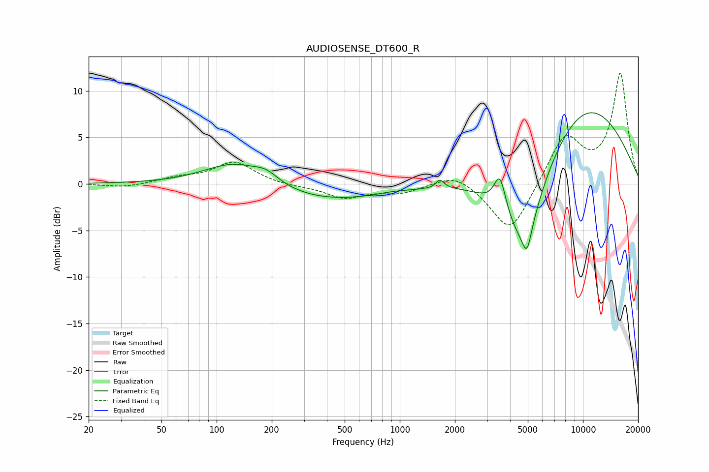

# AUDIOSENSE_DT600_R
See [usage instructions](https://github.com/jaakkopasanen/AutoEq#usage) for more options and info.

### Parametric EQs
Apply preamp of -7.7 dB when using parametric equalizer.

|   # | Type    |   Fc (Hz) |    Q |   Gain (dB) |
|-----|---------|-----------|------|-------------|
|   1 | Peaking |       126 | 0.84 |         2.6 |
|   2 | Peaking |       187 | 2.18 |         1   |
|   3 | Peaking |       390 | 0.44 |        -1.8 |
|   4 | Peaking |       911 | 2.19 |         0.1 |
|   5 | Peaking |      1608 | 5.27 |        -0.6 |
|   6 | Peaking |      1641 | 5.88 |         1.5 |
|   7 | Peaking |      3523 | 4.37 |         3.9 |
|   8 | Peaking |      4722 | 1    |       -11.3 |
|   9 | Peaking |      4951 | 5.55 |        -2.8 |
|  10 | Peaking |      9336 | 0.39 |         9.9 |

### Fixed Band EQs
When using fixed band (also called graphic) equalizer, apply preamp of **-12.0 dB** (if available) and set gains manually with these parameters.

|   # | Type    |   Fc (Hz) |    Q |   Gain (dB) |
|-----|---------|-----------|------|-------------|
|   1 | Peaking |        31 | 1.41 |        -0.4 |
|   2 | Peaking |        62 | 1.41 |         0.6 |
|   3 | Peaking |       125 | 1.41 |         2.3 |
|   4 | Peaking |       250 | 1.41 |        -0.2 |
|   5 | Peaking |       500 | 1.41 |        -1.5 |
|   6 | Peaking |      1000 | 1.41 |        -0.9 |
|   7 | Peaking |      2000 | 1.41 |         1.3 |
|   8 | Peaking |      4000 | 1.41 |        -5.5 |
|   9 | Peaking |      8000 | 1.41 |         5.2 |
|  10 | Peaking |     16000 | 1.41 |        11.8 |

### Graphs

