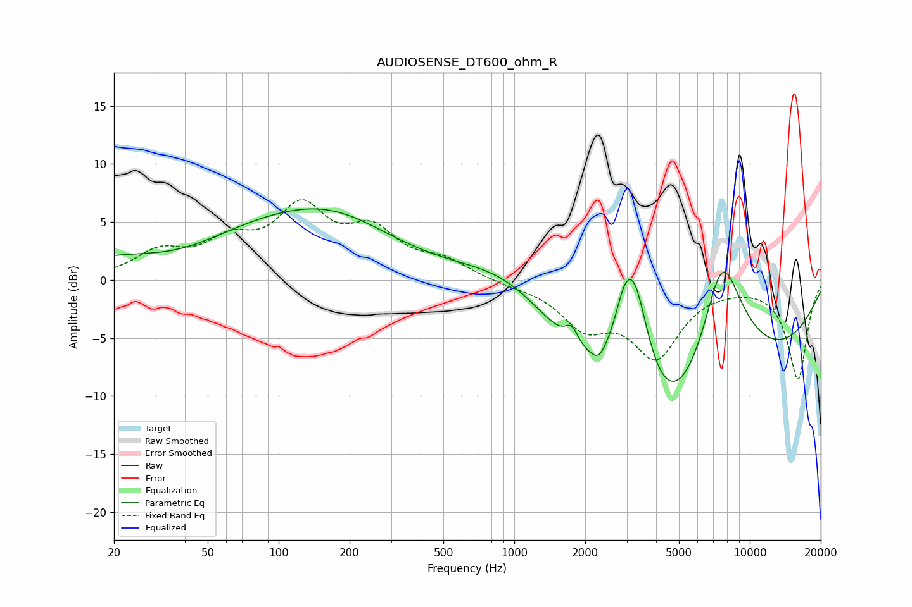

# AUDIOSENSE_DT600_ohm_R
See [usage instructions](https://github.com/jaakkopasanen/AutoEq#usage) for more options and info.

### Parametric EQs
Apply preamp of -6.2 dB when using parametric equalizer.

|   # | Type    |   Fc (Hz) |    Q |   Gain (dB) |
|-----|---------|-----------|------|-------------|
|   1 | Peaking |        38 | 0.62 |        -2.6 |
|   2 | Peaking |        60 | 0.26 |         5.3 |
|   3 | Peaking |       178 | 0.59 |         2.5 |
|   4 | Peaking |      1005 | 0.54 |         6.2 |
|   5 | Peaking |      1755 | 4.98 |         1.6 |
|   6 | Peaking |      2284 | 5.75 |        -0.7 |
|   7 | Peaking |      2942 | 3.03 |         4.2 |
|   8 | Peaking |      3274 | 2.04 |         9.6 |
|   9 | Peaking |      4658 | 0.28 |       -20   |
|  10 | Peaking |      7597 | 1.04 |        16.4 |

### Fixed Band EQs
When using fixed band (also called graphic) equalizer, apply preamp of **-7.0 dB** (if available) and set gains manually with these parameters.

|   # | Type    |   Fc (Hz) |    Q |   Gain (dB) |
|-----|---------|-----------|------|-------------|
|   1 | Peaking |        31 | 1.41 |         2.2 |
|   2 | Peaking |        62 | 1.41 |         2.7 |
|   3 | Peaking |       125 | 1.41 |         5.6 |
|   4 | Peaking |       250 | 1.41 |         3.7 |
|   5 | Peaking |       500 | 1.41 |         1.4 |
|   6 | Peaking |      1000 | 1.41 |        -0.3 |
|   7 | Peaking |      2000 | 1.41 |        -3.6 |
|   8 | Peaking |      4000 | 1.41 |        -6.2 |
|   9 | Peaking |      8000 | 1.41 |        -0.2 |
|  10 | Peaking |     16000 | 1.41 |        -8.5 |

### Graphs

