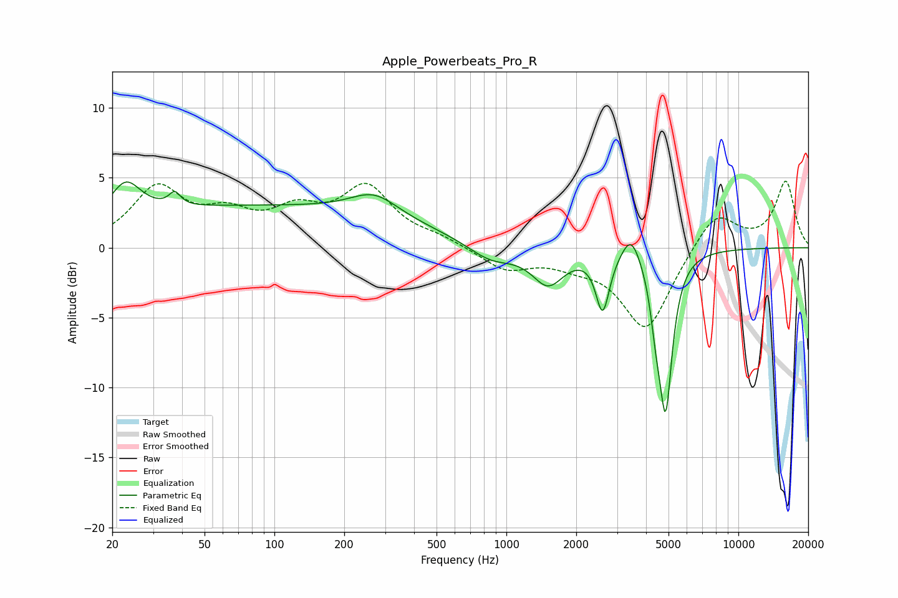

# Apple_Powerbeats_Pro_R
See [usage instructions](https://github.com/jaakkopasanen/AutoEq#usage) for more options and info.

### Parametric EQs
Apply preamp of -4.8 dB when using parametric equalizer.

|   # | Type    |   Fc (Hz) |    Q |   Gain (dB) |
|-----|---------|-----------|------|-------------|
|   1 | Peaking |        23 | 2.19 |         2.5 |
|   2 | Peaking |        37 | 5.89 |         0.9 |
|   3 | Peaking |        83 | 0.18 |         2.9 |
|   4 | Peaking |       270 | 1.37 |         1.6 |
|   5 | Peaking |       857 | 1.41 |        -1.2 |
|   6 | Peaking |      1513 | 2.05 |        -2.5 |
|   7 | Peaking |      2601 | 4.91 |        -4.2 |
|   8 | Peaking |      3447 | 3.54 |         2   |
|   9 | Peaking |      4411 | 6    |        -2.6 |
|  10 | Peaking |      4859 | 4.87 |       -10.9 |

### Fixed Band EQs
When using fixed band (also called graphic) equalizer, apply preamp of **-4.8 dB** (if available) and set gains manually with these parameters.

|   # | Type    |   Fc (Hz) |    Q |   Gain (dB) |
|-----|---------|-----------|------|-------------|
|   1 | Peaking |        31 | 1.41 |         4.1 |
|   2 | Peaking |        62 | 1.41 |         1.9 |
|   3 | Peaking |       125 | 1.41 |         2.2 |
|   4 | Peaking |       250 | 1.41 |         4.1 |
|   5 | Peaking |       500 | 1.41 |         0.6 |
|   6 | Peaking |      1000 | 1.41 |        -1.5 |
|   7 | Peaking |      2000 | 1.41 |        -0.8 |
|   8 | Peaking |      4000 | 1.41 |        -5.9 |
|   9 | Peaking |      8000 | 1.41 |         2.7 |
|  10 | Peaking |     16000 | 1.41 |         4.7 |

### Graphs

