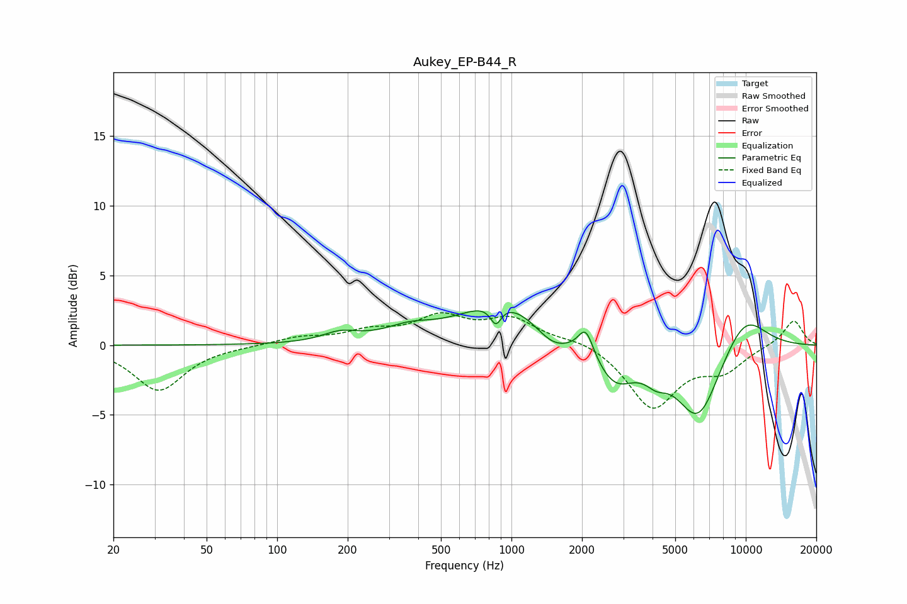

# Aukey_EP-B44_R
See [usage instructions](https://github.com/jaakkopasanen/AutoEq#usage) for more options and info.

### Parametric EQs
Apply preamp of -2.6 dB when using parametric equalizer.

|   # | Type    |   Fc (Hz) |    Q |   Gain (dB) |
|-----|---------|-----------|------|-------------|
|   1 | Peaking |       186 | 1.86 |         0.7 |
|   2 | Peaking |       364 | 1.36 |         0.8 |
|   3 | Peaking |       858 | 6    |        -1.4 |
|   4 | Peaking |       918 | 0.79 |         3.2 |
|   5 | Peaking |      1490 | 1.89 |        -1.2 |
|   6 | Peaking |      2076 | 4.38 |         2   |
|   7 | Peaking |      2763 | 1.65 |        -2.7 |
|   8 | Peaking |      4150 | 2.91 |        -1   |
|   9 | Peaking |      6271 | 1.45 |        -5.4 |
|  10 | Peaking |      9838 | 1.26 |         2.7 |

### Fixed Band EQs
When using fixed band (also called graphic) equalizer, apply preamp of **-2.4 dB** (if available) and set gains manually with these parameters.

|   # | Type    |   Fc (Hz) |    Q |   Gain (dB) |
|-----|---------|-----------|------|-------------|
|   1 | Peaking |        31 | 1.41 |        -3.2 |
|   2 | Peaking |        62 | 1.41 |        -0   |
|   3 | Peaking |       125 | 1.41 |         0.5 |
|   4 | Peaking |       250 | 1.41 |         0.9 |
|   5 | Peaking |       500 | 1.41 |         1.9 |
|   6 | Peaking |      1000 | 1.41 |         1.7 |
|   7 | Peaking |      2000 | 1.41 |         0.5 |
|   8 | Peaking |      4000 | 1.41 |        -4.4 |
|   9 | Peaking |      8000 | 1.41 |        -1.6 |
|  10 | Peaking |     16000 | 1.41 |         1.8 |

### Graphs

