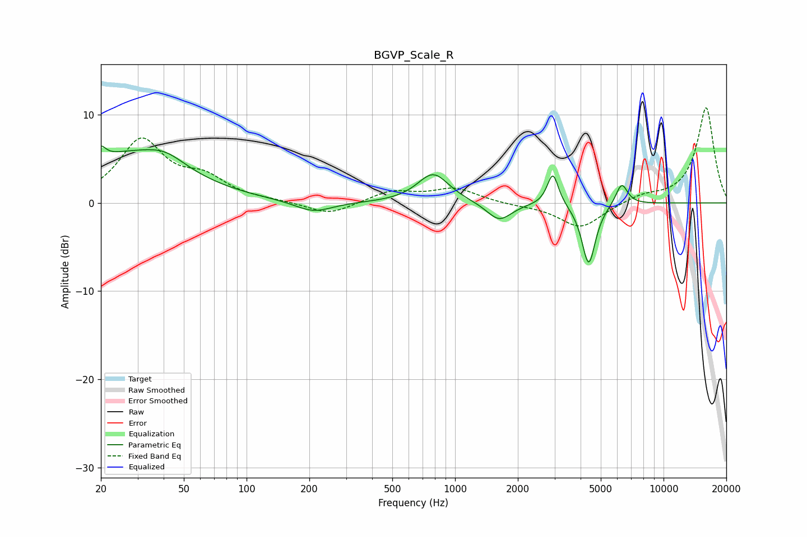

# BGVP_Scale_R
See [usage instructions](https://github.com/jaakkopasanen/AutoEq#usage) for more options and info.

### Parametric EQs
Apply preamp of -6.5 dB when using parametric equalizer.

|   # | Type    |   Fc (Hz) |    Q |   Gain (dB) |
|-----|---------|-----------|------|-------------|
|   1 | Peaking |        20 | 6    |         4.5 |
|   2 | Peaking |        20 | 5.94 |        -3.1 |
|   3 | Peaking |        27 | 0.52 |         5.2 |
|   4 | Peaking |        41 | 1.49 |         1.4 |
|   5 | Peaking |       209 | 1.57 |        -1.3 |
|   6 | Peaking |       786 | 1.88 |         3.3 |
|   7 | Peaking |      1628 | 2.37 |        -2.1 |
|   8 | Peaking |      2946 | 5.26 |         3.7 |
|   9 | Peaking |      4375 | 4.29 |        -7   |
|  10 | Peaking |      6296 | 4.82 |         2.5 |

### Fixed Band EQs
When using fixed band (also called graphic) equalizer, apply preamp of **-10.9 dB** (if available) and set gains manually with these parameters.

|   # | Type    |   Fc (Hz) |    Q |   Gain (dB) |
|-----|---------|-----------|------|-------------|
|   1 | Peaking |        31 | 1.41 |         6.9 |
|   2 | Peaking |        62 | 1.41 |         2.4 |
|   3 | Peaking |       125 | 1.41 |         0.1 |
|   4 | Peaking |       250 | 1.41 |        -1.4 |
|   5 | Peaking |       500 | 1.41 |         1.3 |
|   6 | Peaking |      1000 | 1.41 |         1.6 |
|   7 | Peaking |      2000 | 1.41 |        -0.2 |
|   8 | Peaking |      4000 | 1.41 |        -2.9 |
|   9 | Peaking |      8000 | 1.41 |         0.8 |
|  10 | Peaking |     16000 | 1.41 |        10.8 |

### Graphs

