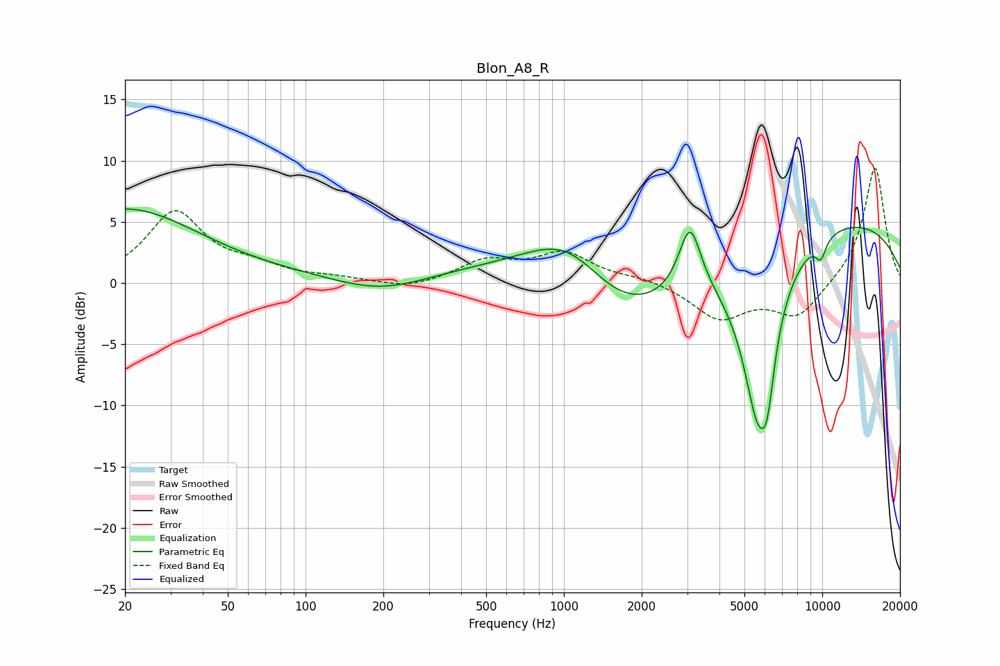

# Blon_A8_R
See [usage instructions](https://github.com/jaakkopasanen/AutoEq#usage) for more options and info.

### Parametric EQs
Apply preamp of -6.2 dB when using parametric equalizer.

|   # | Type    |   Fc (Hz) |    Q |   Gain (dB) |
|-----|---------|-----------|------|-------------|
|   1 | Peaking |        20 | 0.49 |         6   |
|   2 | Peaking |       197 | 0.7  |        -2.2 |
|   3 | Peaking |       547 | 0.2  |         2.1 |
|   4 | Peaking |      1065 | 0.7  |         7.9 |
|   5 | Peaking |      1533 | 0.48 |        -9.4 |
|   6 | Peaking |      3077 | 3.26 |         5.6 |
|   7 | Peaking |      5622 | 2.03 |       -13.3 |
|   8 | Peaking |      6127 | 5.17 |        -4.1 |
|   9 | Peaking |      9424 | 0.23 |         5.7 |
|  10 | Peaking |      9871 | 6    |        -1.6 |

### Fixed Band EQs
When using fixed band (also called graphic) equalizer, apply preamp of **-9.5 dB** (if available) and set gains manually with these parameters.

|   # | Type    |   Fc (Hz) |    Q |   Gain (dB) |
|-----|---------|-----------|------|-------------|
|   1 | Peaking |        31 | 1.41 |         5.7 |
|   2 | Peaking |        62 | 1.41 |         1.1 |
|   3 | Peaking |       125 | 1.41 |         0.3 |
|   4 | Peaking |       250 | 1.41 |        -0.6 |
|   5 | Peaking |       500 | 1.41 |         1.7 |
|   6 | Peaking |      1000 | 1.41 |         2.3 |
|   7 | Peaking |      2000 | 1.41 |         0.4 |
|   8 | Peaking |      4000 | 1.41 |        -2.9 |
|   9 | Peaking |      8000 | 1.41 |        -2.8 |
|  10 | Peaking |     16000 | 1.41 |         9.6 |

### Graphs

