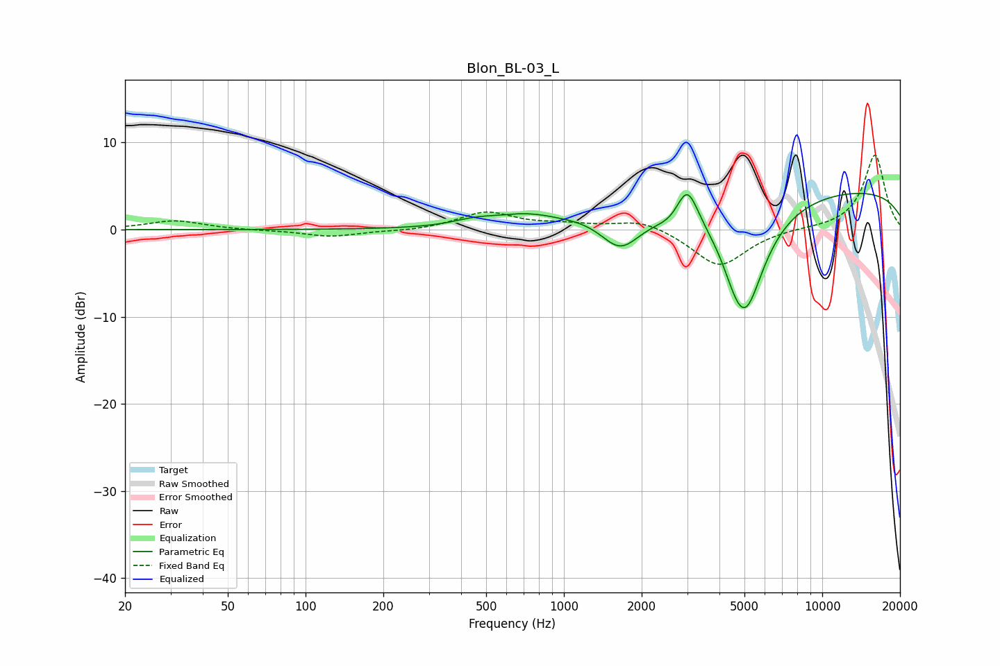

# Blon_BL-03_L
See [usage instructions](https://github.com/jaakkopasanen/AutoEq#usage) for more options and info.

### Parametric EQs
Apply preamp of -4.2 dB when using parametric equalizer.

|   # | Type    |   Fc (Hz) |    Q |   Gain (dB) |
|-----|---------|-----------|------|-------------|
|   1 | Peaking |       451 | 1.66 |         0.6 |
|   2 | Peaking |       717 | 1.1  |         1.4 |
|   3 | Peaking |      1213 | 1.46 |         0.4 |
|   4 | Peaking |      1655 | 1.88 |        -3.6 |
|   5 | Peaking |      2615 | 2.68 |        -0.9 |
|   6 | Peaking |      3002 | 3.28 |         4.7 |
|   7 | Peaking |      4536 | 5.87 |         1.5 |
|   8 | Peaking |      4544 | 4.7  |        -2.9 |
|   9 | Peaking |      5059 | 1.73 |       -12.6 |
|  10 | Peaking |      9983 | 0.18 |         4.8 |

### Fixed Band EQs
When using fixed band (also called graphic) equalizer, apply preamp of **-8.6 dB** (if available) and set gains manually with these parameters.

|   # | Type    |   Fc (Hz) |    Q |   Gain (dB) |
|-----|---------|-----------|------|-------------|
|   1 | Peaking |        31 | 1.41 |         1   |
|   2 | Peaking |        62 | 1.41 |        -0.1 |
|   3 | Peaking |       125 | 1.41 |        -0.8 |
|   4 | Peaking |       250 | 1.41 |        -0.2 |
|   5 | Peaking |       500 | 1.41 |         2   |
|   6 | Peaking |      1000 | 1.41 |         0.5 |
|   7 | Peaking |      2000 | 1.41 |         1.2 |
|   8 | Peaking |      4000 | 1.41 |        -4.3 |
|   9 | Peaking |      8000 | 1.41 |         0.1 |
|  10 | Peaking |     16000 | 1.41 |         8.6 |

### Graphs

