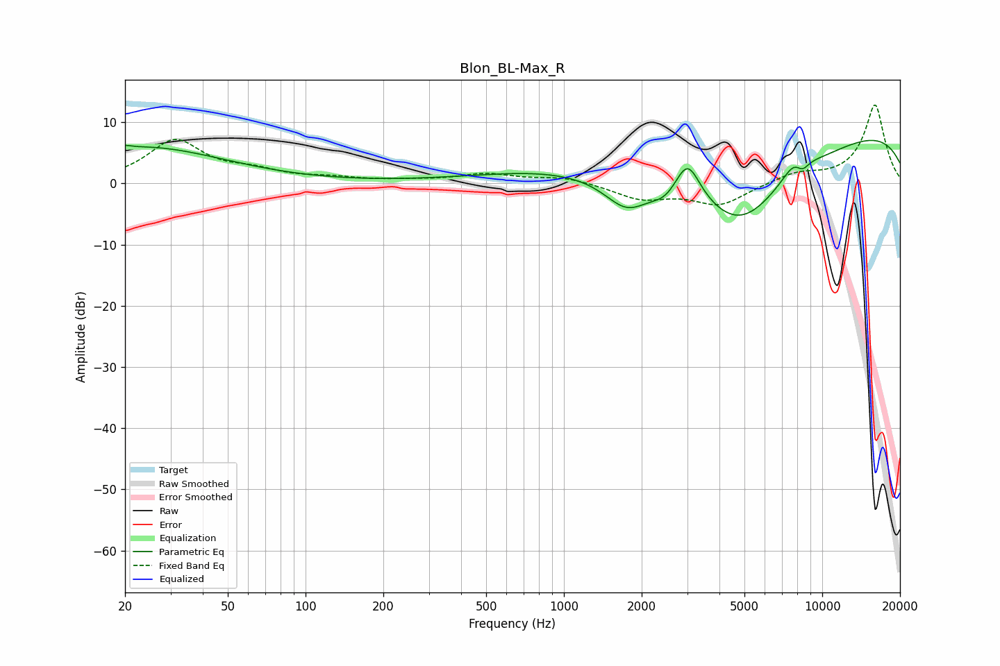

# Blon_BL-Max_R
See [usage instructions](https://github.com/jaakkopasanen/AutoEq#usage) for more options and info.

### Parametric EQs
Apply preamp of -7.1 dB when using parametric equalizer.

|   # | Type    |   Fc (Hz) |    Q |   Gain (dB) |
|-----|---------|-----------|------|-------------|
|   1 | Peaking |        20 | 5.97 |         0.4 |
|   2 | Peaking |        24 | 0.45 |         5.9 |
|   3 | Peaking |      1041 | 0.42 |         2.3 |
|   4 | Peaking |      1747 | 1.62 |        -5   |
|   5 | Peaking |      2465 | 3.01 |        -1.5 |
|   6 | Peaking |      3014 | 2.83 |         6.8 |
|   7 | Peaking |      4805 | 0.58 |       -15.3 |
|   8 | Peaking |      7994 | 2.5  |         4.1 |
|   9 | Peaking |      8354 | 4.42 |        -2.7 |
|  10 | Peaking |      9824 | 0.18 |        10.2 |

### Fixed Band EQs
When using fixed band (also called graphic) equalizer, apply preamp of **-12.9 dB** (if available) and set gains manually with these parameters.

|   # | Type    |   Fc (Hz) |    Q |   Gain (dB) |
|-----|---------|-----------|------|-------------|
|   1 | Peaking |        31 | 1.41 |         6.9 |
|   2 | Peaking |        62 | 1.41 |         1.6 |
|   3 | Peaking |       125 | 1.41 |         0.7 |
|   4 | Peaking |       250 | 1.41 |         0.3 |
|   5 | Peaking |       500 | 1.41 |         1.5 |
|   6 | Peaking |      1000 | 1.41 |         1   |
|   7 | Peaking |      2000 | 1.41 |        -2.4 |
|   8 | Peaking |      4000 | 1.41 |        -3.5 |
|   9 | Peaking |      8000 | 1.41 |         1.6 |
|  10 | Peaking |     16000 | 1.41 |        12.9 |

### Graphs

