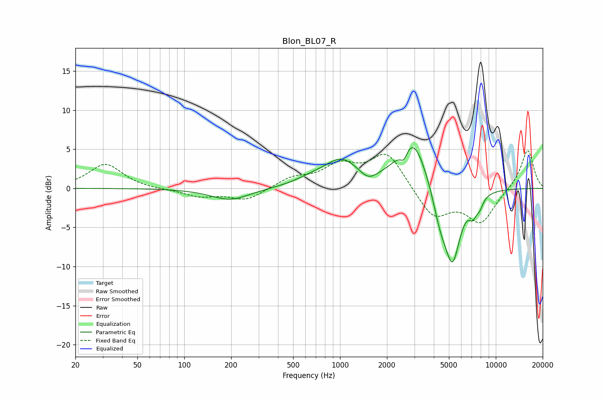

# Blon_BL07_R
See [usage instructions](https://github.com/jaakkopasanen/AutoEq#usage) for more options and info.

### Parametric EQs
Apply preamp of -5.3 dB when using parametric equalizer.

|   # | Type    |   Fc (Hz) |    Q |   Gain (dB) |
|-----|---------|-----------|------|-------------|
|   1 | Peaking |       197 | 1.13 |        -1.5 |
|   2 | Peaking |       662 | 1.25 |         0.8 |
|   3 | Peaking |      1023 | 1.32 |         3.2 |
|   4 | Peaking |      1520 | 2.73 |        -1.1 |
|   5 | Peaking |      2571 | 6    |        -1.5 |
|   6 | Peaking |      2921 | 1.49 |         6.7 |
|   7 | Peaking |      4398 | 2.76 |        -3.7 |
|   8 | Peaking |      5277 | 2.65 |        -9   |
|   9 | Peaking |      7110 | 5.3  |        -1.8 |
|  10 | Peaking |      7870 | 5.61 |        -1.2 |

### Fixed Band EQs
When using fixed band (also called graphic) equalizer, apply preamp of **-4.9 dB** (if available) and set gains manually with these parameters.

|   # | Type    |   Fc (Hz) |    Q |   Gain (dB) |
|-----|---------|-----------|------|-------------|
|   1 | Peaking |        31 | 1.41 |         3.1 |
|   2 | Peaking |        62 | 1.41 |        -0.1 |
|   3 | Peaking |       125 | 1.41 |        -1   |
|   4 | Peaking |       250 | 1.41 |        -1.5 |
|   5 | Peaking |       500 | 1.41 |         1.2 |
|   6 | Peaking |      1000 | 1.41 |         2.6 |
|   7 | Peaking |      2000 | 1.41 |         4.5 |
|   8 | Peaking |      4000 | 1.41 |        -3.8 |
|   9 | Peaking |      8000 | 1.41 |        -4.2 |
|  10 | Peaking |     16000 | 1.41 |         5.1 |

### Graphs

