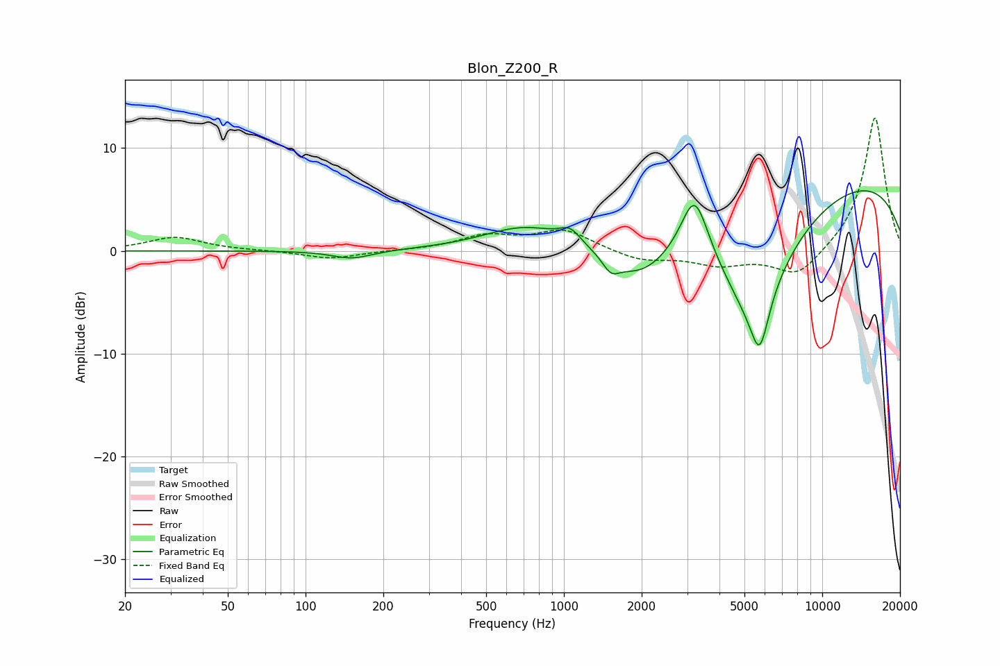

# Blon_Z200_R
See [usage instructions](https://github.com/jaakkopasanen/AutoEq#usage) for more options and info.

### Parametric EQs
Apply preamp of -5.9 dB when using parametric equalizer.

|   # | Type    |   Fc (Hz) |    Q |   Gain (dB) |
|-----|---------|-----------|------|-------------|
|   1 | Peaking |       151 | 1.83 |        -0.8 |
|   2 | Peaking |       707 | 0.88 |         2.3 |
|   3 | Peaking |      1059 | 3.44 |         1.3 |
|   4 | Peaking |      1521 | 4.47 |        -1.3 |
|   5 | Peaking |      1947 | 1.1  |        -3.8 |
|   6 | Peaking |      3208 | 2.56 |         6.7 |
|   7 | Peaking |      5371 | 0.87 |       -11.6 |
|   8 | Peaking |      5724 | 3.96 |        -5.1 |
|   9 | Peaking |      9286 | 0.18 |         3.1 |
|  10 | Peaking |     10000 | 0.23 |         4.6 |

### Fixed Band EQs
When using fixed band (also called graphic) equalizer, apply preamp of **-13.0 dB** (if available) and set gains manually with these parameters.

|   # | Type    |   Fc (Hz) |    Q |   Gain (dB) |
|-----|---------|-----------|------|-------------|
|   1 | Peaking |        31 | 1.41 |         1.3 |
|   2 | Peaking |        62 | 1.41 |         0   |
|   3 | Peaking |       125 | 1.41 |        -0.8 |
|   4 | Peaking |       250 | 1.41 |         0   |
|   5 | Peaking |       500 | 1.41 |         1.4 |
|   6 | Peaking |      1000 | 1.41 |         2   |
|   7 | Peaking |      2000 | 1.41 |        -1   |
|   8 | Peaking |      4000 | 1.41 |        -1.3 |
|   9 | Peaking |      8000 | 1.41 |        -2.7 |
|  10 | Peaking |     16000 | 1.41 |        13.2 |

### Graphs

