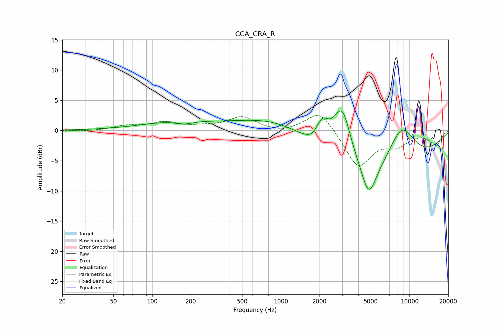

# CCA_CRA_R
See [usage instructions](https://github.com/jaakkopasanen/AutoEq#usage) for more options and info.

### Parametric EQs
Apply preamp of -3.3 dB when using parametric equalizer.

|   # | Type    |   Fc (Hz) |    Q |   Gain (dB) |
|-----|---------|-----------|------|-------------|
|   1 | Peaking |       157 | 0.51 |         1.4 |
|   2 | Peaking |       178 | 2.05 |        -0.6 |
|   3 | Peaking |      1076 | 0.46 |         5.9 |
|   4 | Peaking |      1772 | 2.72 |        -0.7 |
|   5 | Peaking |      2089 | 2.95 |         3.3 |
|   6 | Peaking |      3033 | 1.62 |        11.5 |
|   7 | Peaking |      3464 | 2.27 |        -1.1 |
|   8 | Peaking |      4157 | 0.24 |       -11.2 |
|   9 | Peaking |      4826 | 2.5  |        -5.5 |
|  10 | Peaking |      8640 | 1.06 |         8.5 |

### Fixed Band EQs
When using fixed band (also called graphic) equalizer, apply preamp of **-2.6 dB** (if available) and set gains manually with these parameters.

|   # | Type    |   Fc (Hz) |    Q |   Gain (dB) |
|-----|---------|-----------|------|-------------|
|   1 | Peaking |        31 | 1.41 |        -0.2 |
|   2 | Peaking |        62 | 1.41 |         0.7 |
|   3 | Peaking |       125 | 1.41 |         1.2 |
|   4 | Peaking |       250 | 1.41 |         0.5 |
|   5 | Peaking |       500 | 1.41 |         2.2 |
|   6 | Peaking |      1000 | 1.41 |        -0.5 |
|   7 | Peaking |      2000 | 1.41 |         3.6 |
|   8 | Peaking |      4000 | 1.41 |        -6.1 |
|   9 | Peaking |      8000 | 1.41 |        -2.1 |
|  10 | Peaking |     16000 | 1.41 |        -2.4 |

### Graphs

