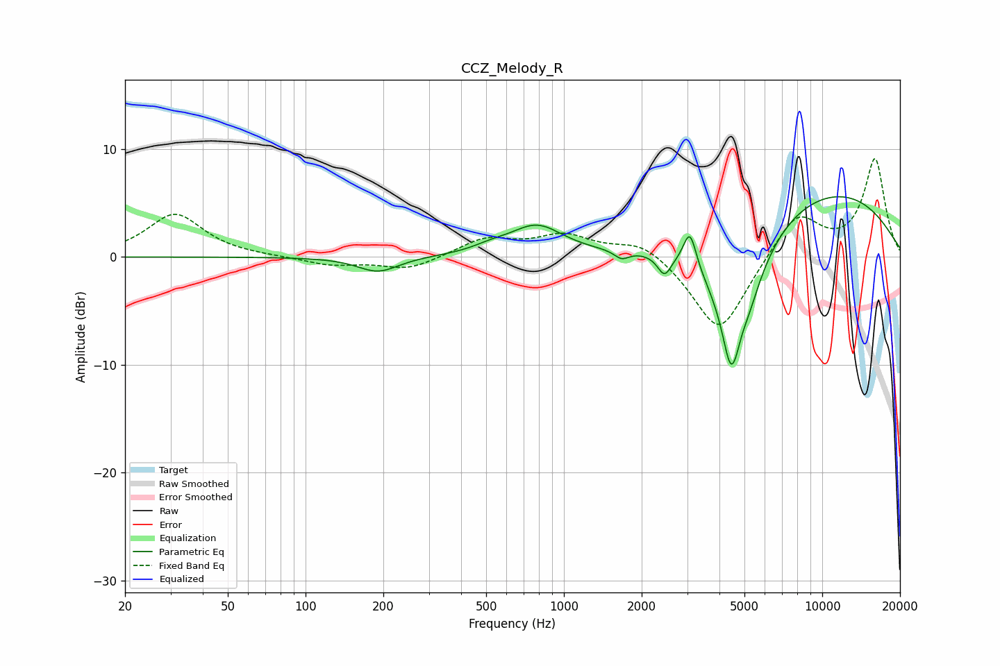

# CCZ_Melody_R
See [usage instructions](https://github.com/jaakkopasanen/AutoEq#usage) for more options and info.

### Parametric EQs
Apply preamp of -5.7 dB when using parametric equalizer.

|   # | Type    |   Fc (Hz) |    Q |   Gain (dB) |
|-----|---------|-----------|------|-------------|
|   1 | Peaking |       191 | 1.8  |        -1.4 |
|   2 | Peaking |       523 | 1.97 |         0.5 |
|   3 | Peaking |       785 | 1.39 |         2.8 |
|   4 | Peaking |      1672 | 5.04 |        -0.8 |
|   5 | Peaking |      2451 | 5.31 |        -1.9 |
|   6 | Peaking |      3074 | 5.76 |         3.4 |
|   7 | Peaking |      4409 | 5.59 |        -2.7 |
|   8 | Peaking |      4670 | 1.8  |       -12.7 |
|   9 | Peaking |      4857 | 5.87 |         1.5 |
|  10 | Peaking |     10000 | 0.34 |         6.4 |

### Fixed Band EQs
When using fixed band (also called graphic) equalizer, apply preamp of **-9.2 dB** (if available) and set gains manually with these parameters.

|   # | Type    |   Fc (Hz) |    Q |   Gain (dB) |
|-----|---------|-----------|------|-------------|
|   1 | Peaking |        31 | 1.41 |         4   |
|   2 | Peaking |        62 | 1.41 |         0   |
|   3 | Peaking |       125 | 1.41 |        -0.7 |
|   4 | Peaking |       250 | 1.41 |        -1.2 |
|   5 | Peaking |       500 | 1.41 |         1.7 |
|   6 | Peaking |      1000 | 1.41 |         1.9 |
|   7 | Peaking |      2000 | 1.41 |         1.6 |
|   8 | Peaking |      4000 | 1.41 |        -7.3 |
|   9 | Peaking |      8000 | 1.41 |         4.2 |
|  10 | Peaking |     16000 | 1.41 |         9   |

### Graphs

