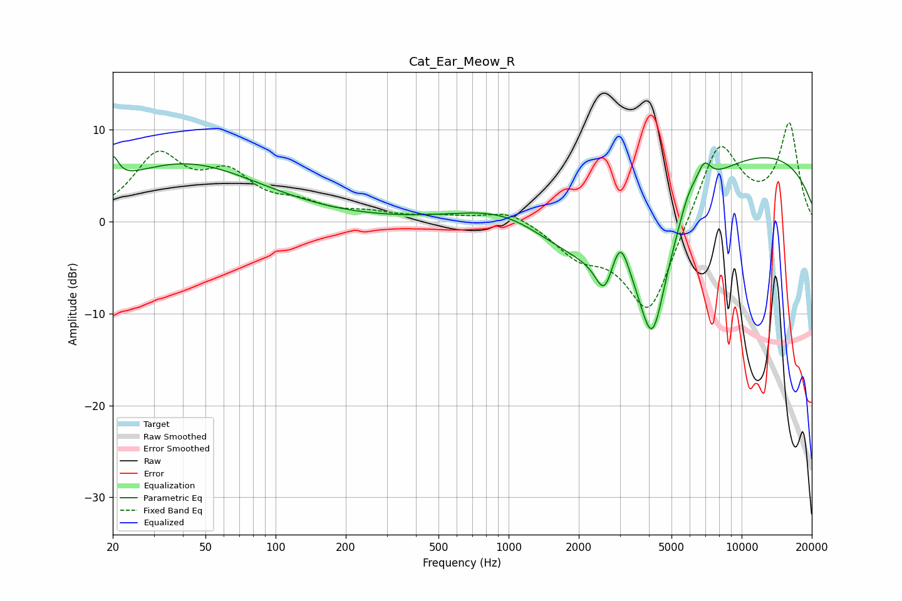

# Cat_Ear_Meow_R
See [usage instructions](https://github.com/jaakkopasanen/AutoEq#usage) for more options and info.

### Parametric EQs
Apply preamp of -7.2 dB when using parametric equalizer.

|   # | Type    |   Fc (Hz) |    Q |   Gain (dB) |
|-----|---------|-----------|------|-------------|
|   1 | Peaking |        20 | 6    |         2.8 |
|   2 | Peaking |        41 | 0.43 |         6.2 |
|   3 | Peaking |       993 | 0.67 |         3.3 |
|   4 | Peaking |      2263 | 0.49 |        -6.8 |
|   5 | Peaking |      2575 | 3.77 |        -3.8 |
|   6 | Peaking |      3015 | 3.72 |         4.3 |
|   7 | Peaking |      4135 | 2    |       -13.9 |
|   8 | Peaking |      5927 | 3.28 |         2.1 |
|   9 | Peaking |      6903 | 4.45 |         2.5 |
|  10 | Peaking |      9983 | 0.23 |         8   |

### Fixed Band EQs
When using fixed band (also called graphic) equalizer, apply preamp of **-10.8 dB** (if available) and set gains manually with these parameters.

|   # | Type    |   Fc (Hz) |    Q |   Gain (dB) |
|-----|---------|-----------|------|-------------|
|   1 | Peaking |        31 | 1.41 |         6.8 |
|   2 | Peaking |        62 | 1.41 |         4.4 |
|   3 | Peaking |       125 | 1.41 |         1.5 |
|   4 | Peaking |       250 | 1.41 |         0.7 |
|   5 | Peaking |       500 | 1.41 |         0.5 |
|   6 | Peaking |      1000 | 1.41 |         1.4 |
|   7 | Peaking |      2000 | 1.41 |        -3   |
|   8 | Peaking |      4000 | 1.41 |       -10.4 |
|   9 | Peaking |      8000 | 1.41 |         9.2 |
|  10 | Peaking |     16000 | 1.41 |        10.4 |

### Graphs

