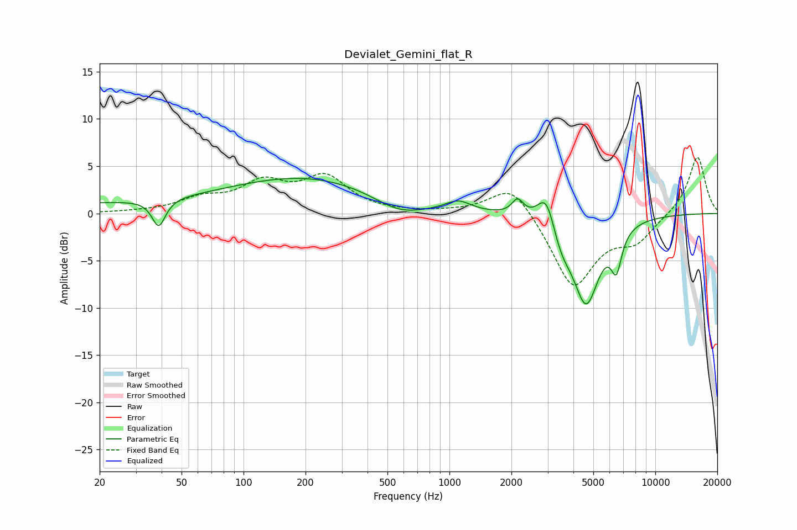

# Devialet_Gemini_flat_R
See [usage instructions](https://github.com/jaakkopasanen/AutoEq#usage) for more options and info.

### Parametric EQs
Apply preamp of -3.8 dB when using parametric equalizer.

|   # | Type    |   Fc (Hz) |    Q |   Gain (dB) |
|-----|---------|-----------|------|-------------|
|   1 | Peaking |        24 | 0.19 |         1   |
|   2 | Peaking |        39 | 4.44 |        -2.9 |
|   3 | Peaking |       215 | 0.39 |         3.6 |
|   4 | Peaking |       570 | 1.12 |        -1.7 |
|   5 | Peaking |      1103 | 2.34 |         1.1 |
|   6 | Peaking |      2144 | 5.06 |         1.6 |
|   7 | Peaking |      2964 | 3.26 |         3.8 |
|   8 | Peaking |      3477 | 2.86 |        -2.3 |
|   9 | Peaking |      4614 | 2.12 |        -9.2 |
|  10 | Peaking |      6471 | 5.28 |        -3.8 |

### Fixed Band EQs
When using fixed band (also called graphic) equalizer, apply preamp of **-6.0 dB** (if available) and set gains manually with these parameters.

|   # | Type    |   Fc (Hz) |    Q |   Gain (dB) |
|-----|---------|-----------|------|-------------|
|   1 | Peaking |        31 | 1.41 |         0.1 |
|   2 | Peaking |        62 | 1.41 |         1.4 |
|   3 | Peaking |       125 | 1.41 |         2.9 |
|   4 | Peaking |       250 | 1.41 |         3.6 |
|   5 | Peaking |       500 | 1.41 |         0   |
|   6 | Peaking |      1000 | 1.41 |         0.1 |
|   7 | Peaking |      2000 | 1.41 |         3.4 |
|   8 | Peaking |      4000 | 1.41 |        -7.9 |
|   9 | Peaking |      8000 | 1.41 |        -2.6 |
|  10 | Peaking |     16000 | 1.41 |         6.1 |

### Graphs

