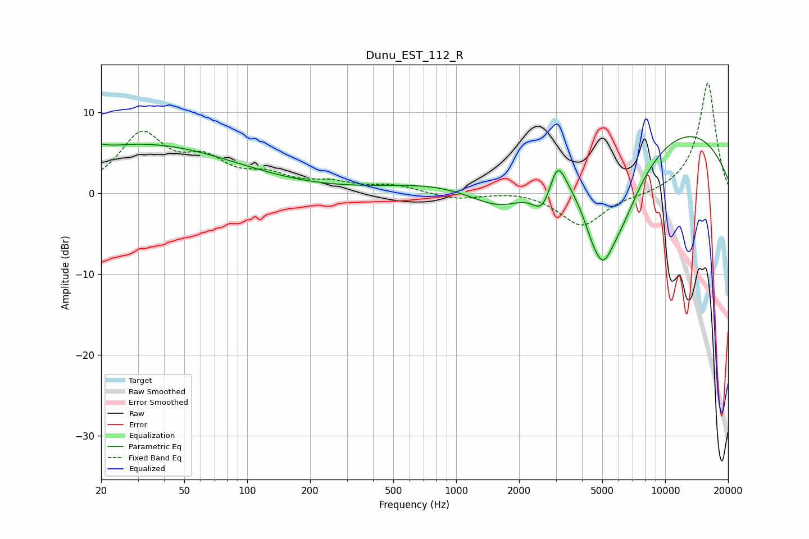

# Dunu_EST_112_R
See [usage instructions](https://github.com/jaakkopasanen/AutoEq#usage) for more options and info.

### Parametric EQs
Apply preamp of -7.1 dB when using parametric equalizer.

|   # | Type    |   Fc (Hz) |    Q |   Gain (dB) |
|-----|---------|-----------|------|-------------|
|   1 | Peaking |        20 | 6    |         0.4 |
|   2 | Peaking |        31 | 0.31 |         6   |
|   3 | Peaking |      1678 | 0.71 |        -7.7 |
|   4 | Peaking |      2593 | 2.87 |        -3.6 |
|   5 | Peaking |      3051 | 3.77 |         3.8 |
|   6 | Peaking |      4623 | 2.25 |        -5.3 |
|   7 | Peaking |      4891 | 0.19 |         9   |
|   8 | Peaking |      5100 | 3.64 |        -2.6 |
|   9 | Peaking |      5872 | 0.92 |       -13.1 |
|  10 | Peaking |      9631 | 0.18 |         3.4 |

### Fixed Band EQs
When using fixed band (also called graphic) equalizer, apply preamp of **-13.7 dB** (if available) and set gains manually with these parameters.

|   # | Type    |   Fc (Hz) |    Q |   Gain (dB) |
|-----|---------|-----------|------|-------------|
|   1 | Peaking |        31 | 1.41 |         7   |
|   2 | Peaking |        62 | 1.41 |         3.4 |
|   3 | Peaking |       125 | 1.41 |         1.8 |
|   4 | Peaking |       250 | 1.41 |         1.1 |
|   5 | Peaking |       500 | 1.41 |         0.9 |
|   6 | Peaking |      1000 | 1.41 |        -0.7 |
|   7 | Peaking |      2000 | 1.41 |         0.4 |
|   8 | Peaking |      4000 | 1.41 |        -4.1 |
|   9 | Peaking |      8000 | 1.41 |        -0.3 |
|  10 | Peaking |     16000 | 1.41 |        13.8 |

### Graphs

