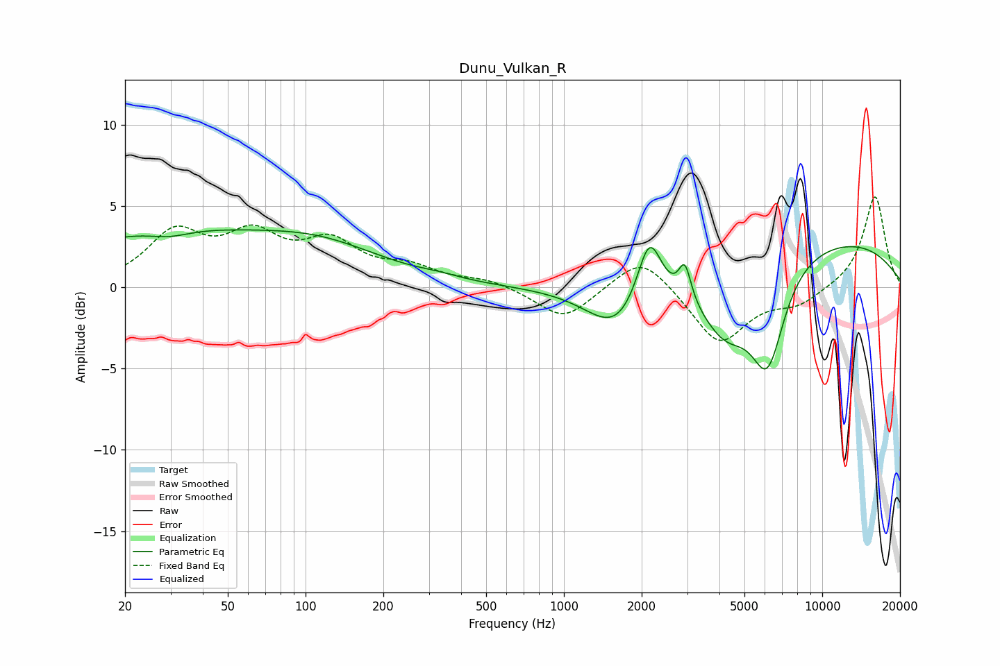

# Dunu_Vulkan_R
See [usage instructions](https://github.com/jaakkopasanen/AutoEq#usage) for more options and info.

### Parametric EQs
Apply preamp of -3.6 dB when using parametric equalizer.

|   # | Type    |   Fc (Hz) |    Q |   Gain (dB) |
|-----|---------|-----------|------|-------------|
|   1 | Peaking |        27 | 0.34 |         3.2 |
|   2 | Peaking |        30 | 1.79 |        -0.4 |
|   3 | Peaking |       117 | 0.57 |         2   |
|   4 | Peaking |       329 | 1.76 |         0.2 |
|   5 | Peaking |      1610 | 1.22 |        -2.8 |
|   6 | Peaking |      2142 | 2.93 |         4.2 |
|   7 | Peaking |      2940 | 5.99 |         2.2 |
|   8 | Peaking |      4242 | 1.32 |        -3.9 |
|   9 | Peaking |      6149 | 2.12 |        -5.8 |
|  10 | Peaking |     10000 | 0.29 |         3.1 |

### Fixed Band EQs
When using fixed band (also called graphic) equalizer, apply preamp of **-5.7 dB** (if available) and set gains manually with these parameters.

|   # | Type    |   Fc (Hz) |    Q |   Gain (dB) |
|-----|---------|-----------|------|-------------|
|   1 | Peaking |        31 | 1.41 |         3.1 |
|   2 | Peaking |        62 | 1.41 |         2.8 |
|   3 | Peaking |       125 | 1.41 |         2.4 |
|   4 | Peaking |       250 | 1.41 |         1   |
|   5 | Peaking |       500 | 1.41 |         0.5 |
|   6 | Peaking |      1000 | 1.41 |        -2   |
|   7 | Peaking |      2000 | 1.41 |         2.2 |
|   8 | Peaking |      4000 | 1.41 |        -3.5 |
|   9 | Peaking |      8000 | 1.41 |        -1   |
|  10 | Peaking |     16000 | 1.41 |         5.7 |

### Graphs

