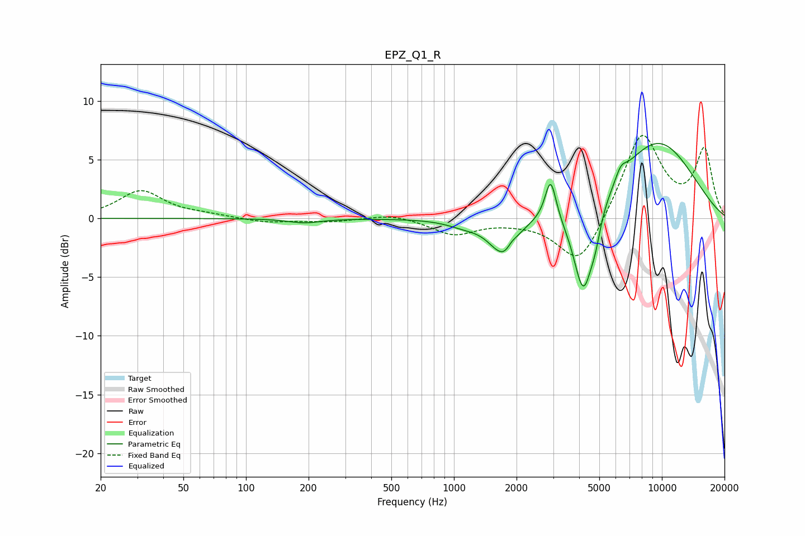

# EPZ_Q1_R
See [usage instructions](https://github.com/jaakkopasanen/AutoEq#usage) for more options and info.

### Parametric EQs
Apply preamp of -6.5 dB when using parametric equalizer.

|   # | Type    |   Fc (Hz) |    Q |   Gain (dB) |
|-----|---------|-----------|------|-------------|
|   1 | Peaking |       191 | 1.83 |        -0.4 |
|   2 | Peaking |      1109 | 1.78 |        -0.5 |
|   3 | Peaking |      1711 | 2.07 |        -2.9 |
|   4 | Peaking |      1796 | 4.46 |        -0.4 |
|   5 | Peaking |      1883 | 6    |         0.5 |
|   6 | Peaking |      2917 | 5.35 |         3.6 |
|   7 | Peaking |      4198 | 2.83 |        -8   |
|   8 | Peaking |      4794 | 5.98 |        -1.3 |
|   9 | Peaking |      6352 | 5.34 |         0.9 |
|  10 | Peaking |      9432 | 0.6  |         6.6 |

### Fixed Band EQs
When using fixed band (also called graphic) equalizer, apply preamp of **-7.2 dB** (if available) and set gains manually with these parameters.

|   # | Type    |   Fc (Hz) |    Q |   Gain (dB) |
|-----|---------|-----------|------|-------------|
|   1 | Peaking |        31 | 1.41 |         2.3 |
|   2 | Peaking |        62 | 1.41 |         0.2 |
|   3 | Peaking |       125 | 1.41 |        -0.4 |
|   4 | Peaking |       250 | 1.41 |        -0.3 |
|   5 | Peaking |       500 | 1.41 |         0.4 |
|   6 | Peaking |      1000 | 1.41 |        -1.3 |
|   7 | Peaking |      2000 | 1.41 |        -0.2 |
|   8 | Peaking |      4000 | 1.41 |        -4.2 |
|   9 | Peaking |      8000 | 1.41 |         7.4 |
|  10 | Peaking |     16000 | 1.41 |         5.7 |

### Graphs

