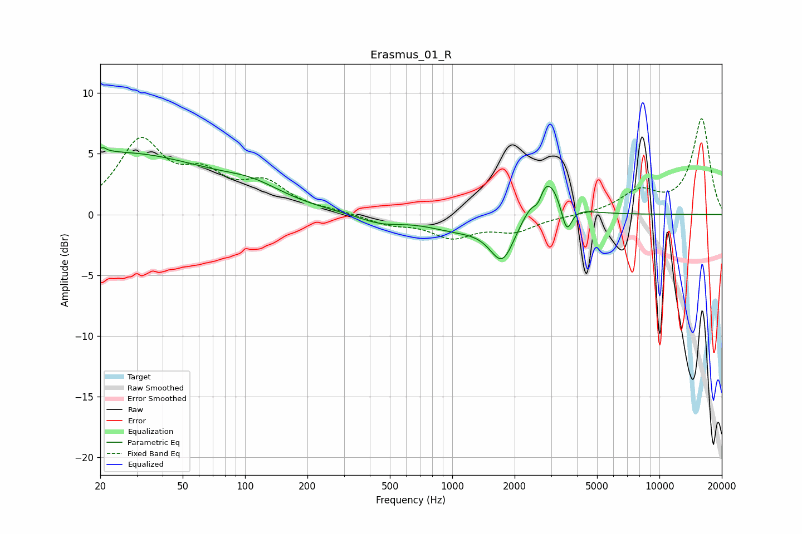

# Erasmus_01_R
See [usage instructions](https://github.com/jaakkopasanen/AutoEq#usage) for more options and info.

### Parametric EQs
Apply preamp of -5.6 dB when using parametric equalizer.

|   # | Type    |   Fc (Hz) |    Q |   Gain (dB) |
|-----|---------|-----------|------|-------------|
|   1 | Peaking |        21 | 5.71 |         3.4 |
|   2 | Peaking |        21 | 5.98 |        -2.9 |
|   3 | Peaking |        25 | 0.32 |         5   |
|   4 | Peaking |       109 | 0.94 |         1.2 |
|   5 | Peaking |       450 | 1.35 |        -0.7 |
|   6 | Peaking |      1066 | 0.89 |        -1.1 |
|   7 | Peaking |      1750 | 2.3  |        -3.7 |
|   8 | Peaking |      2595 | 5.91 |        -1.3 |
|   9 | Peaking |      2812 | 2.05 |         4   |
|  10 | Peaking |      3565 | 5.52 |        -2.5 |

### Fixed Band EQs
When using fixed band (also called graphic) equalizer, apply preamp of **-8.0 dB** (if available) and set gains manually with these parameters.

|   # | Type    |   Fc (Hz) |    Q |   Gain (dB) |
|-----|---------|-----------|------|-------------|
|   1 | Peaking |        31 | 1.41 |         5.8 |
|   2 | Peaking |        62 | 1.41 |         2.6 |
|   3 | Peaking |       125 | 1.41 |         2.3 |
|   4 | Peaking |       250 | 1.41 |         0.2 |
|   5 | Peaking |       500 | 1.41 |        -0.7 |
|   6 | Peaking |      1000 | 1.41 |        -1.7 |
|   7 | Peaking |      2000 | 1.41 |        -1.2 |
|   8 | Peaking |      4000 | 1.41 |        -0.1 |
|   9 | Peaking |      8000 | 1.41 |         1.8 |
|  10 | Peaking |     16000 | 1.41 |         7.9 |

### Graphs

