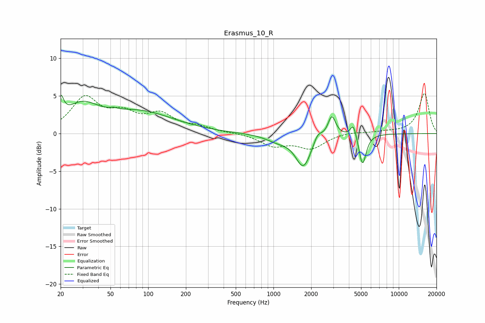

# Erasmus_10_R
See [usage instructions](https://github.com/jaakkopasanen/AutoEq#usage) for more options and info.

### Parametric EQs
Apply preamp of -5.2 dB when using parametric equalizer.

|   # | Type    |   Fc (Hz) |    Q |   Gain (dB) |
|-----|---------|-----------|------|-------------|
|   1 | Peaking |        20 | 5.98 |         2.8 |
|   2 | Peaking |        29 | 1.1  |         3.1 |
|   3 | Peaking |        53 | 5.93 |         0.2 |
|   4 | Peaking |        85 | 0.5  |         2.8 |
|   5 | Peaking |      1076 | 1.52 |        -0.8 |
|   6 | Peaking |      1734 | 2.28 |        -4.3 |
|   7 | Peaking |      2250 | 4.3  |         1.2 |
|   8 | Peaking |      2922 | 4.61 |         2.7 |
|   9 | Peaking |      4343 | 6    |         1.8 |
|  10 | Peaking |      5138 | 4.94 |        -4.2 |

### Fixed Band EQs
When using fixed band (also called graphic) equalizer, apply preamp of **-5.4 dB** (if available) and set gains manually with these parameters.

|   # | Type    |   Fc (Hz) |    Q |   Gain (dB) |
|-----|---------|-----------|------|-------------|
|   1 | Peaking |        31 | 1.41 |         4.6 |
|   2 | Peaking |        62 | 1.41 |         2.2 |
|   3 | Peaking |       125 | 1.41 |         2.3 |
|   4 | Peaking |       250 | 1.41 |         0.7 |
|   5 | Peaking |       500 | 1.41 |         0.1 |
|   6 | Peaking |      1000 | 1.41 |        -1.5 |
|   7 | Peaking |      2000 | 1.41 |        -1.9 |
|   8 | Peaking |      4000 | 1.41 |         0.3 |
|   9 | Peaking |      8000 | 1.41 |         0.2 |
|  10 | Peaking |     16000 | 1.41 |         5.3 |

### Graphs

