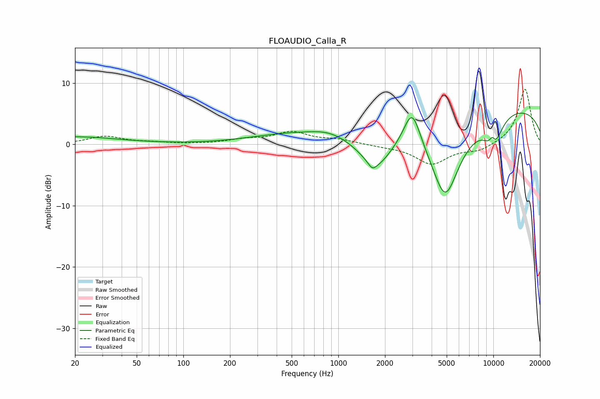

# FLOAUDIO_Calla_R
See [usage instructions](https://github.com/jaakkopasanen/AutoEq#usage) for more options and info.

### Parametric EQs
Apply preamp of -5.2 dB when using parametric equalizer.

|   # | Type    |   Fc (Hz) |    Q |   Gain (dB) |
|-----|---------|-----------|------|-------------|
|   1 | Peaking |        20 | 0.51 |         1.2 |
|   2 | Peaking |       465 | 0.56 |         1.5 |
|   3 | Peaking |       872 | 1.1  |         1.3 |
|   4 | Peaking |      1657 | 5.66 |        -1   |
|   5 | Peaking |      1759 | 1.3  |        -5.5 |
|   6 | Peaking |      2993 | 2.56 |         6.4 |
|   7 | Peaking |      4892 | 1.32 |       -13.7 |
|   8 | Peaking |      9829 | 0.18 |         6.5 |
|   9 | Peaking |      9846 | 6    |         1.9 |
|  10 | Peaking |     10000 | 2.29 |        -5   |

### Fixed Band EQs
When using fixed band (also called graphic) equalizer, apply preamp of **-9.1 dB** (if available) and set gains manually with these parameters.

|   # | Type    |   Fc (Hz) |    Q |   Gain (dB) |
|-----|---------|-----------|------|-------------|
|   1 | Peaking |        31 | 1.41 |         1.3 |
|   2 | Peaking |        62 | 1.41 |         0.3 |
|   3 | Peaking |       125 | 1.41 |         0   |
|   4 | Peaking |       250 | 1.41 |         0.7 |
|   5 | Peaking |       500 | 1.41 |         1.9 |
|   6 | Peaking |      1000 | 1.41 |         0.7 |
|   7 | Peaking |      2000 | 1.41 |        -0.2 |
|   8 | Peaking |      4000 | 1.41 |        -3.2 |
|   9 | Peaking |      8000 | 1.41 |        -1.1 |
|  10 | Peaking |     16000 | 1.41 |         9.1 |

### Graphs

