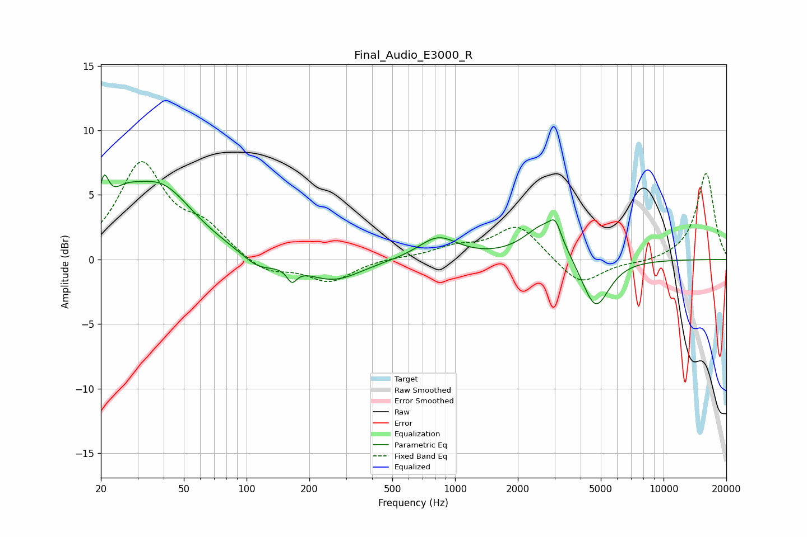

# Final_Audio_E3000_R
See [usage instructions](https://github.com/jaakkopasanen/AutoEq#usage) for more options and info.

### Parametric EQs
Apply preamp of -6.6 dB when using parametric equalizer.

|   # | Type    |   Fc (Hz) |    Q |   Gain (dB) |
|-----|---------|-----------|------|-------------|
|   1 | Peaking |        21 | 5.9  |         3   |
|   2 | Peaking |        26 | 1.79 |         2.1 |
|   3 | Peaking |        39 | 0.88 |         5.3 |
|   4 | Peaking |       114 | 1.84 |        -1   |
|   5 | Peaking |       165 | 5.98 |        -1.1 |
|   6 | Peaking |       260 | 1.05 |        -1.7 |
|   7 | Peaking |       828 | 1.5  |         1.7 |
|   8 | Peaking |      2692 | 1.5  |         2.8 |
|   9 | Peaking |      3028 | 5.22 |         1.3 |
|  10 | Peaking |      4712 | 2.1  |        -4.1 |

### Fixed Band EQs
When using fixed band (also called graphic) equalizer, apply preamp of **-7.7 dB** (if available) and set gains manually with these parameters.

|   # | Type    |   Fc (Hz) |    Q |   Gain (dB) |
|-----|---------|-----------|------|-------------|
|   1 | Peaking |        31 | 1.41 |         7.2 |
|   2 | Peaking |        62 | 1.41 |         2.1 |
|   3 | Peaking |       125 | 1.41 |        -1.1 |
|   4 | Peaking |       250 | 1.41 |        -1.7 |
|   5 | Peaking |       500 | 1.41 |         0.1 |
|   6 | Peaking |      1000 | 1.41 |         0.8 |
|   7 | Peaking |      2000 | 1.41 |         2.7 |
|   8 | Peaking |      4000 | 1.41 |        -2.1 |
|   9 | Peaking |      8000 | 1.41 |        -0.2 |
|  10 | Peaking |     16000 | 1.41 |         6.7 |

### Graphs

