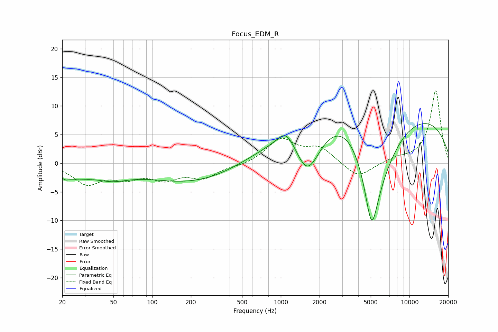

# Focus_EDM_R
See [usage instructions](https://github.com/jaakkopasanen/AutoEq#usage) for more options and info.

### Parametric EQs
Apply preamp of -7.0 dB when using parametric equalizer.

|   # | Type    |   Fc (Hz) |    Q |   Gain (dB) |
|-----|---------|-----------|------|-------------|
|   1 | Peaking |        21 | 5.22 |        -0.6 |
|   2 | Peaking |        25 | 1.15 |        -1.9 |
|   3 | Peaking |        49 | 1.04 |        -1.8 |
|   4 | Peaking |       331 | 0.28 |        -4.8 |
|   5 | Peaking |      1102 | 2.09 |         0.3 |
|   6 | Peaking |      1108 | 2.01 |         3   |
|   7 | Peaking |      1614 | 1.21 |       -10.4 |
|   8 | Peaking |      4594 | 0.2  |        20   |
|   9 | Peaking |      5077 | 2.02 |       -15.4 |
|  10 | Peaking |      5916 | 0.57 |       -14.1 |

### Fixed Band EQs
When using fixed band (also called graphic) equalizer, apply preamp of **-12.7 dB** (if available) and set gains manually with these parameters.

|   # | Type    |   Fc (Hz) |    Q |   Gain (dB) |
|-----|---------|-----------|------|-------------|
|   1 | Peaking |        31 | 1.41 |        -3.4 |
|   2 | Peaking |        62 | 1.41 |        -2.1 |
|   3 | Peaking |       125 | 1.41 |        -2.4 |
|   4 | Peaking |       250 | 1.41 |        -2.3 |
|   5 | Peaking |       500 | 1.41 |        -0.4 |
|   6 | Peaking |      1000 | 1.41 |         4.1 |
|   7 | Peaking |      2000 | 1.41 |         2.6 |
|   8 | Peaking |      4000 | 1.41 |        -2.7 |
|   9 | Peaking |      8000 | 1.41 |         0.7 |
|  10 | Peaking |     16000 | 1.41 |        12.7 |

### Graphs

