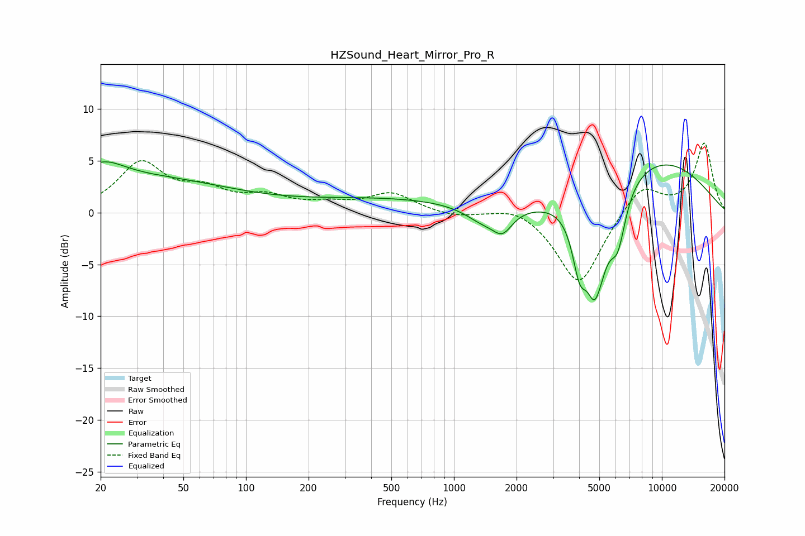

# HZSound_Heart_Mirror_Pro_R
See [usage instructions](https://github.com/jaakkopasanen/AutoEq#usage) for more options and info.

### Parametric EQs
Apply preamp of -5.0 dB when using parametric equalizer.

|   # | Type    |   Fc (Hz) |    Q |   Gain (dB) |
|-----|---------|-----------|------|-------------|
|   1 | Peaking |        20 | 1.29 |         2.3 |
|   2 | Peaking |        36 | 0.36 |         3   |
|   3 | Peaking |       477 | 0.34 |         1.3 |
|   4 | Peaking |      1386 | 1.59 |        -1.5 |
|   5 | Peaking |      1715 | 3.01 |        -1.9 |
|   6 | Peaking |      4015 | 4.05 |        -4.6 |
|   7 | Peaking |      4820 | 2.83 |       -10.3 |
|   8 | Peaking |      4907 | 6    |         1.1 |
|   9 | Peaking |      6136 | 3.52 |        -4.7 |
|  10 | Peaking |      9255 | 0.43 |         5.2 |

### Fixed Band EQs
When using fixed band (also called graphic) equalizer, apply preamp of **-6.8 dB** (if available) and set gains manually with these parameters.

|   # | Type    |   Fc (Hz) |    Q |   Gain (dB) |
|-----|---------|-----------|------|-------------|
|   1 | Peaking |        31 | 1.41 |         4.6 |
|   2 | Peaking |        62 | 1.41 |         1.8 |
|   3 | Peaking |       125 | 1.41 |         1.3 |
|   4 | Peaking |       250 | 1.41 |         0.7 |
|   5 | Peaking |       500 | 1.41 |         1.8 |
|   6 | Peaking |      1000 | 1.41 |        -0.4 |
|   7 | Peaking |      2000 | 1.41 |         0.9 |
|   8 | Peaking |      4000 | 1.41 |        -7.1 |
|   9 | Peaking |      8000 | 1.41 |         2.8 |
|  10 | Peaking |     16000 | 1.41 |         6.7 |

### Graphs

