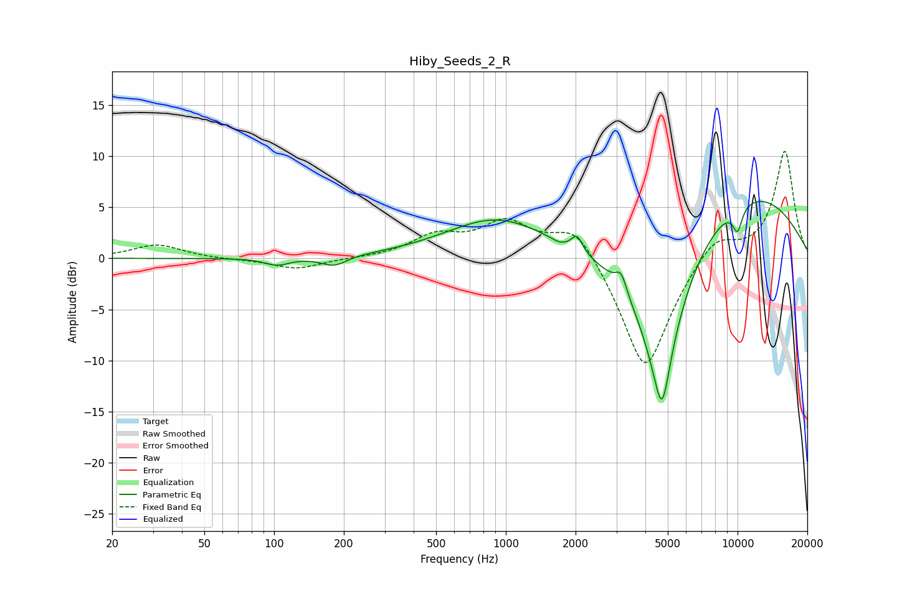

# Hiby_Seeds_2_R
See [usage instructions](https://github.com/jaakkopasanen/AutoEq#usage) for more options and info.

### Parametric EQs
Apply preamp of -5.7 dB when using parametric equalizer.

|   # | Type    |   Fc (Hz) |    Q |   Gain (dB) |
|-----|---------|-----------|------|-------------|
|   1 | Peaking |       103 | 2.71 |        -0.7 |
|   2 | Peaking |       181 | 2.59 |        -1   |
|   3 | Peaking |       917 | 0.64 |         3.9 |
|   4 | Peaking |      1702 | 5.01 |        -0.2 |
|   5 | Peaking |      2030 | 5.89 |         1.6 |
|   6 | Peaking |      3146 | 5.93 |         1.8 |
|   7 | Peaking |      4672 | 1.28 |       -15.6 |
|   8 | Peaking |      4725 | 5.27 |        -3.7 |
|   9 | Peaking |      9685 | 0.35 |         7.5 |
|  10 | Peaking |     10000 | 5.84 |        -2.4 |

### Fixed Band EQs
When using fixed band (also called graphic) equalizer, apply preamp of **-10.6 dB** (if available) and set gains manually with these parameters.

|   # | Type    |   Fc (Hz) |    Q |   Gain (dB) |
|-----|---------|-----------|------|-------------|
|   1 | Peaking |        31 | 1.41 |         1.3 |
|   2 | Peaking |        62 | 1.41 |        -0.1 |
|   3 | Peaking |       125 | 1.41 |        -1.1 |
|   4 | Peaking |       250 | 1.41 |        -0   |
|   5 | Peaking |       500 | 1.41 |         2   |
|   6 | Peaking |      1000 | 1.41 |         3.3 |
|   7 | Peaking |      2000 | 1.41 |         3.6 |
|   8 | Peaking |      4000 | 1.41 |       -11.5 |
|   9 | Peaking |      8000 | 1.41 |         2.6 |
|  10 | Peaking |     16000 | 1.41 |        10.5 |

### Graphs

