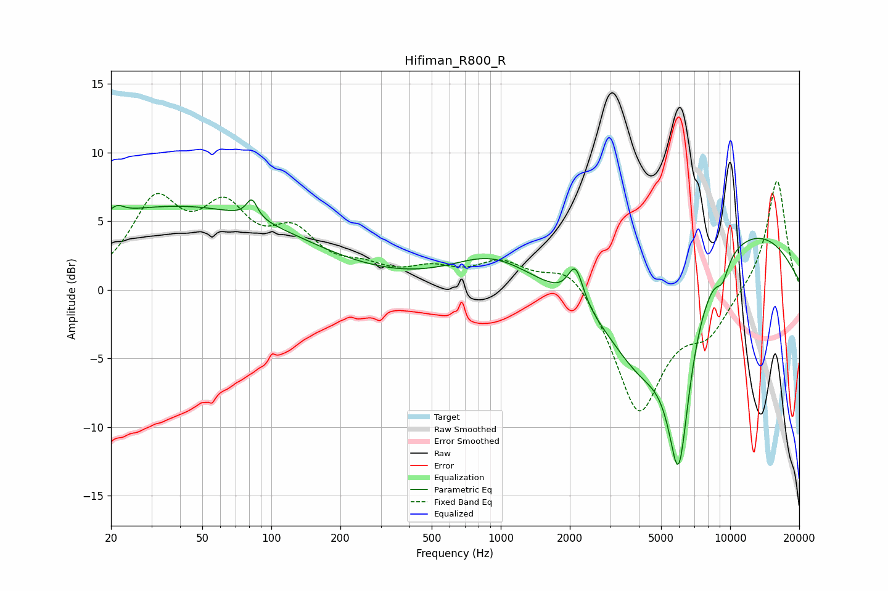

# Hifiman_R800_R
See [usage instructions](https://github.com/jaakkopasanen/AutoEq#usage) for more options and info.

### Parametric EQs
Apply preamp of -6.6 dB when using parametric equalizer.

|   # | Type    |   Fc (Hz) |    Q |   Gain (dB) |
|-----|---------|-----------|------|-------------|
|   1 | Peaking |        21 | 4.52 |         0.7 |
|   2 | Peaking |        38 | 0.3  |         1   |
|   3 | Peaking |        39 | 0.24 |         5.1 |
|   4 | Peaking |        82 | 6    |         1.4 |
|   5 | Peaking |       918 | 0.8  |         2.3 |
|   6 | Peaking |      2119 | 4.25 |         2.7 |
|   7 | Peaking |      4187 | 0.82 |        -7.7 |
|   8 | Peaking |      5967 | 2.78 |       -11.8 |
|   9 | Peaking |      9260 | 4.73 |        -1.4 |
|  10 | Peaking |      9914 | 0.32 |         5.2 |

### Fixed Band EQs
When using fixed band (also called graphic) equalizer, apply preamp of **-8.0 dB** (if available) and set gains manually with these parameters.

|   # | Type    |   Fc (Hz) |    Q |   Gain (dB) |
|-----|---------|-----------|------|-------------|
|   1 | Peaking |        31 | 1.41 |         5.9 |
|   2 | Peaking |        62 | 1.41 |         4.9 |
|   3 | Peaking |       125 | 1.41 |         3.4 |
|   4 | Peaking |       250 | 1.41 |         1.1 |
|   5 | Peaking |       500 | 1.41 |         1.2 |
|   6 | Peaking |      1000 | 1.41 |         1.8 |
|   7 | Peaking |      2000 | 1.41 |         2.2 |
|   8 | Peaking |      4000 | 1.41 |        -9   |
|   9 | Peaking |      8000 | 1.41 |        -2.7 |
|  10 | Peaking |     16000 | 1.41 |         8.2 |

### Graphs

