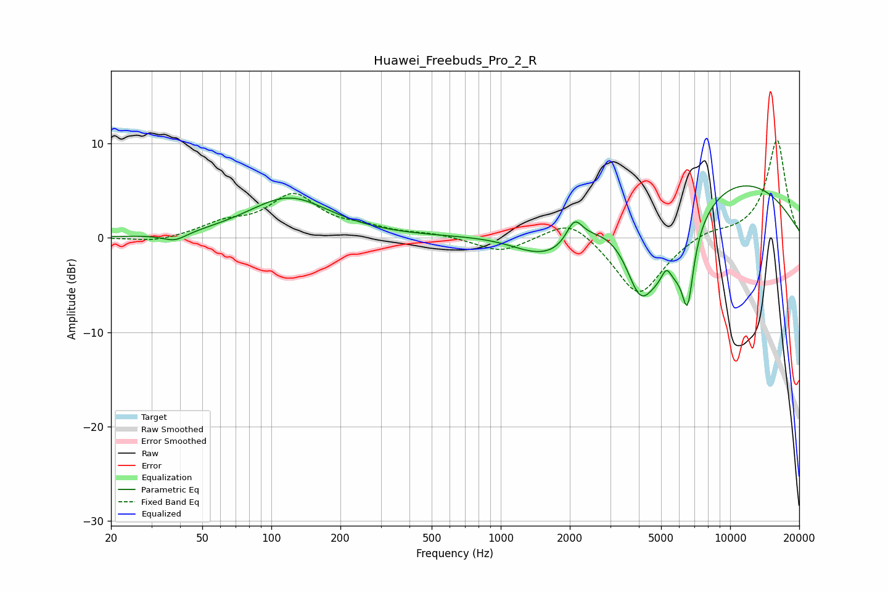

# Huawei_Freebuds_Pro_2_R
See [usage instructions](https://github.com/jaakkopasanen/AutoEq#usage) for more options and info.

### Parametric EQs
Apply preamp of -5.6 dB when using parametric equalizer.

|   # | Type    |   Fc (Hz) |    Q |   Gain (dB) |
|-----|---------|-----------|------|-------------|
|   1 | Peaking |        38 | 2.68 |        -0.9 |
|   2 | Peaking |       119 | 0.8  |         4.2 |
|   3 | Peaking |      1419 | 1.11 |        -1.8 |
|   4 | Peaking |      1850 | 1.2  |        -2.1 |
|   5 | Peaking |      2095 | 3.91 |         2.6 |
|   6 | Peaking |      4048 | 2.14 |        -6.8 |
|   7 | Peaking |      5277 | 5.84 |         2   |
|   8 | Peaking |      5501 | 1.27 |        -9   |
|   9 | Peaking |      6525 | 5.55 |        -6.6 |
|  10 | Peaking |      7720 | 0.28 |         7.7 |

### Fixed Band EQs
When using fixed band (also called graphic) equalizer, apply preamp of **-10.5 dB** (if available) and set gains manually with these parameters.

|   # | Type    |   Fc (Hz) |    Q |   Gain (dB) |
|-----|---------|-----------|------|-------------|
|   1 | Peaking |        31 | 1.41 |        -0.5 |
|   2 | Peaking |        62 | 1.41 |         1.3 |
|   3 | Peaking |       125 | 1.41 |         4.3 |
|   4 | Peaking |       250 | 1.41 |         0.8 |
|   5 | Peaking |       500 | 1.41 |         0.4 |
|   6 | Peaking |      1000 | 1.41 |        -1.6 |
|   7 | Peaking |      2000 | 1.41 |         2.3 |
|   8 | Peaking |      4000 | 1.41 |        -6.3 |
|   9 | Peaking |      8000 | 1.41 |         0.8 |
|  10 | Peaking |     16000 | 1.41 |        10.4 |

### Graphs

