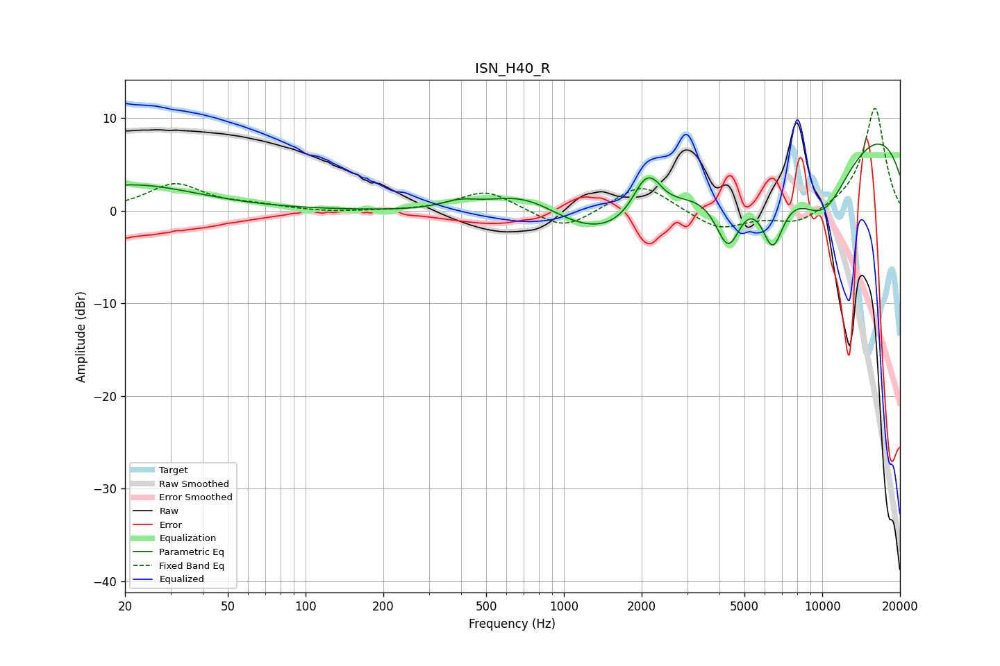

# ISN_H40_R
See [usage instructions](https://github.com/jaakkopasanen/AutoEq#usage) for more options and info.

### Parametric EQs
Apply preamp of -7.3 dB when using parametric equalizer.

|   # | Type    |   Fc (Hz) |    Q |   Gain (dB) |
|-----|---------|-----------|------|-------------|
|   1 | Peaking |        21 | 0.56 |         2.8 |
|   2 | Peaking |       393 | 2.02 |         0.8 |
|   3 | Peaking |       711 | 0.9  |         3.6 |
|   4 | Peaking |      1663 | 0.46 |        -7   |
|   5 | Peaking |      2083 | 2.61 |         4.7 |
|   6 | Peaking |      2279 | 5.87 |         0.3 |
|   7 | Peaking |      4328 | 2.62 |        -7.1 |
|   8 | Peaking |      6427 | 2.89 |        -7.1 |
|   9 | Peaking |      9933 | 0.21 |        13.6 |
|  10 | Peaking |     10000 | 0.78 |       -12.1 |

### Fixed Band EQs
When using fixed band (also called graphic) equalizer, apply preamp of **-11.1 dB** (if available) and set gains manually with these parameters.

|   # | Type    |   Fc (Hz) |    Q |   Gain (dB) |
|-----|---------|-----------|------|-------------|
|   1 | Peaking |        31 | 1.41 |         2.8 |
|   2 | Peaking |        62 | 1.41 |         0.5 |
|   3 | Peaking |       125 | 1.41 |        -0.2 |
|   4 | Peaking |       250 | 1.41 |        -0   |
|   5 | Peaking |       500 | 1.41 |         2.2 |
|   6 | Peaking |      1000 | 1.41 |        -2.2 |
|   7 | Peaking |      2000 | 1.41 |         3.1 |
|   8 | Peaking |      4000 | 1.41 |        -2.1 |
|   9 | Peaking |      8000 | 1.41 |        -1.5 |
|  10 | Peaking |     16000 | 1.41 |        11.2 |

### Graphs

