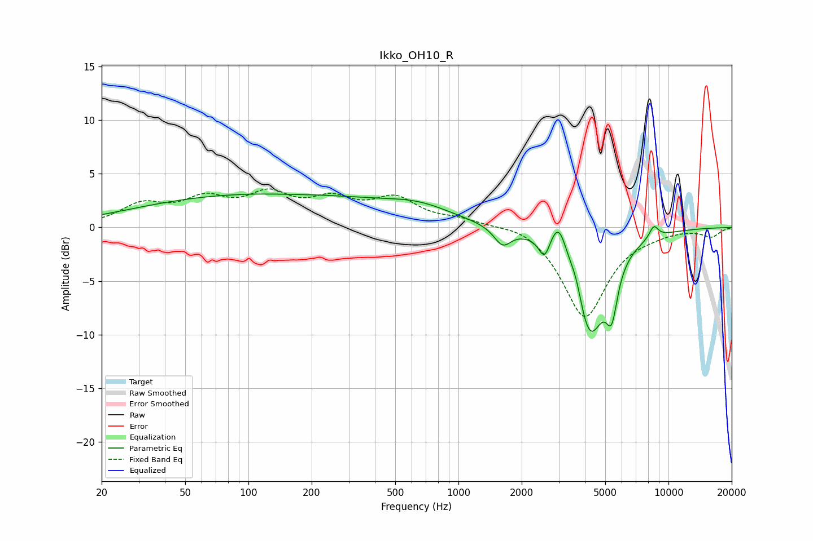

# Ikko_OH10_R
See [usage instructions](https://github.com/jaakkopasanen/AutoEq#usage) for more options and info.

### Parametric EQs
Apply preamp of -3.2 dB when using parametric equalizer.

|   # | Type    |   Fc (Hz) |    Q |   Gain (dB) |
|-----|---------|-----------|------|-------------|
|   1 | Peaking |       121 | 0.22 |         3.1 |
|   2 | Peaking |       159 | 1.52 |        -0.1 |
|   3 | Peaking |       652 | 0.88 |         1.1 |
|   4 | Peaking |      1622 | 3.53 |        -1.7 |
|   5 | Peaking |      2569 | 5.44 |        -2   |
|   6 | Peaking |      3009 | 3.34 |         3.6 |
|   7 | Peaking |      3639 | 4.83 |         1.6 |
|   8 | Peaking |      4205 | 1.8  |       -10.1 |
|   9 | Peaking |      5368 | 5.18 |        -4.1 |
|  10 | Peaking |      8514 | 6    |         1.1 |

### Fixed Band EQs
When using fixed band (also called graphic) equalizer, apply preamp of **-3.7 dB** (if available) and set gains manually with these parameters.

|   # | Type    |   Fc (Hz) |    Q |   Gain (dB) |
|-----|---------|-----------|------|-------------|
|   1 | Peaking |        31 | 1.41 |         1.9 |
|   2 | Peaking |        62 | 1.41 |         2.3 |
|   3 | Peaking |       125 | 1.41 |         2.6 |
|   4 | Peaking |       250 | 1.41 |         2.1 |
|   5 | Peaking |       500 | 1.41 |         2.4 |
|   6 | Peaking |      1000 | 1.41 |         0.6 |
|   7 | Peaking |      2000 | 1.41 |         0.6 |
|   8 | Peaking |      4000 | 1.41 |        -8.4 |
|   9 | Peaking |      8000 | 1.41 |        -0.3 |
|  10 | Peaking |     16000 | 1.41 |        -0.8 |

### Graphs

