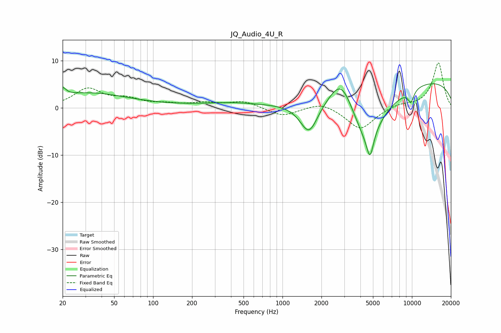

# JQ_Audio_4U_R
See [usage instructions](https://github.com/jaakkopasanen/AutoEq#usage) for more options and info.

### Parametric EQs
Apply preamp of -5.2 dB when using parametric equalizer.

|   # | Type    |   Fc (Hz) |    Q |   Gain (dB) |
|-----|---------|-----------|------|-------------|
|   1 | Peaking |        20 | 5.54 |         1.7 |
|   2 | Peaking |        32 | 0.46 |         3.1 |
|   3 | Peaking |       394 | 0.89 |         0.5 |
|   4 | Peaking |       658 | 0.18 |         0.6 |
|   5 | Peaking |      1604 | 2    |        -6.8 |
|   6 | Peaking |      2855 | 1.42 |         7.8 |
|   7 | Peaking |      4383 | 0.93 |       -12.6 |
|   8 | Peaking |      4746 | 5.18 |        -5.4 |
|   9 | Peaking |      9819 | 5.16 |        -2.5 |
|  10 | Peaking |     10000 | 0.19 |         6.3 |

### Fixed Band EQs
When using fixed band (also called graphic) equalizer, apply preamp of **-9.6 dB** (if available) and set gains manually with these parameters.

|   # | Type    |   Fc (Hz) |    Q |   Gain (dB) |
|-----|---------|-----------|------|-------------|
|   1 | Peaking |        31 | 1.41 |         3.9 |
|   2 | Peaking |        62 | 1.41 |         1.6 |
|   3 | Peaking |       125 | 1.41 |         0.6 |
|   4 | Peaking |       250 | 1.41 |         0.9 |
|   5 | Peaking |       500 | 1.41 |         1.4 |
|   6 | Peaking |      1000 | 1.41 |        -1.8 |
|   7 | Peaking |      2000 | 1.41 |         1.3 |
|   8 | Peaking |      4000 | 1.41 |        -4.6 |
|   9 | Peaking |      8000 | 1.41 |         0.8 |
|  10 | Peaking |     16000 | 1.41 |         9.6 |

### Graphs

