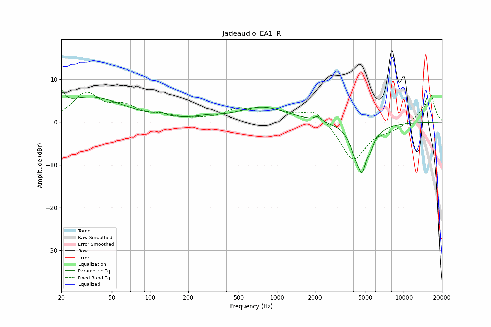

# Jadeaudio_EA1_R
See [usage instructions](https://github.com/jaakkopasanen/AutoEq#usage) for more options and info.

### Parametric EQs
Apply preamp of -7.5 dB when using parametric equalizer.

|   # | Type    |   Fc (Hz) |    Q |   Gain (dB) |
|-----|---------|-----------|------|-------------|
|   1 | Peaking |        20 | 5.82 |         3.3 |
|   2 | Peaking |        34 | 0.55 |         5.8 |
|   3 | Peaking |       120 | 4.08 |         0.7 |
|   4 | Peaking |       284 | 1.57 |         0.6 |
|   5 | Peaking |       773 | 0.75 |         3.4 |
|   6 | Peaking |      2100 | 5.67 |         1   |
|   7 | Peaking |      4075 | 5.02 |        -2.1 |
|   8 | Peaking |      4736 | 2.79 |       -12.1 |
|   9 | Peaking |      5077 | 6    |         2.2 |
|  10 | Peaking |      5378 | 5.93 |        -1.5 |

### Fixed Band EQs
When using fixed band (also called graphic) equalizer, apply preamp of **-7.1 dB** (if available) and set gains manually with these parameters.

|   # | Type    |   Fc (Hz) |    Q |   Gain (dB) |
|-----|---------|-----------|------|-------------|
|   1 | Peaking |        31 | 1.41 |         6.4 |
|   2 | Peaking |        62 | 1.41 |         3.1 |
|   3 | Peaking |       125 | 1.41 |         1.2 |
|   4 | Peaking |       250 | 1.41 |         0.3 |
|   5 | Peaking |       500 | 1.41 |         2.8 |
|   6 | Peaking |      1000 | 1.41 |         2   |
|   7 | Peaking |      2000 | 1.41 |         3.3 |
|   8 | Peaking |      4000 | 1.41 |        -9.2 |
|   9 | Peaking |      8000 | 1.41 |        -1.3 |
|  10 | Peaking |     16000 | 1.41 |         6.9 |

### Graphs

