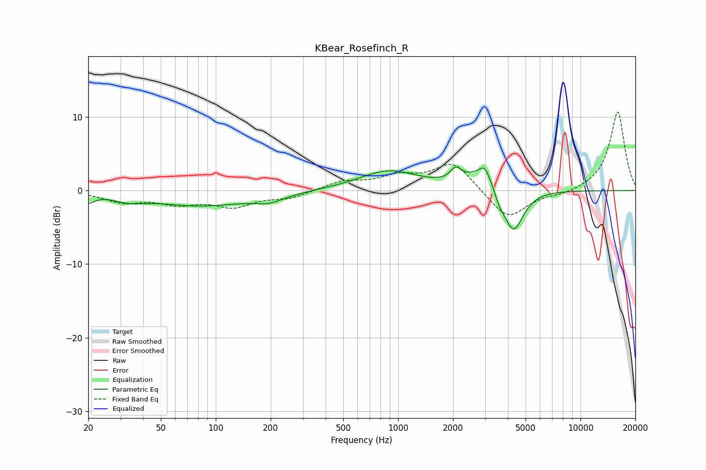

# KBear_Rosefinch_R
See [usage instructions](https://github.com/jaakkopasanen/AutoEq#usage) for more options and info.

### Parametric EQs
Apply preamp of -3.3 dB when using parametric equalizer.

|   # | Type    |   Fc (Hz) |    Q |   Gain (dB) |
|-----|---------|-----------|------|-------------|
|   1 | Peaking |        20 | 4.28 |        -1.2 |
|   2 | Peaking |        33 | 1.69 |        -0.8 |
|   3 | Peaking |        83 | 0.54 |        -2   |
|   4 | Peaking |       197 | 1.71 |        -0.9 |
|   5 | Peaking |       887 | 0.87 |         2.7 |
|   6 | Peaking |      2074 | 4.78 |         1.6 |
|   7 | Peaking |      2972 | 6    |         1.2 |
|   8 | Peaking |      3011 | 1.51 |         3   |
|   9 | Peaking |      3585 | 5.39 |        -1.4 |
|  10 | Peaking |      4271 | 2.5  |        -6.5 |

### Fixed Band EQs
When using fixed band (also called graphic) equalizer, apply preamp of **-10.8 dB** (if available) and set gains manually with these parameters.

|   # | Type    |   Fc (Hz) |    Q |   Gain (dB) |
|-----|---------|-----------|------|-------------|
|   1 | Peaking |        31 | 1.41 |        -1.4 |
|   2 | Peaking |        62 | 1.41 |        -1.5 |
|   3 | Peaking |       125 | 1.41 |        -2   |
|   4 | Peaking |       250 | 1.41 |        -0.9 |
|   5 | Peaking |       500 | 1.41 |         1.2 |
|   6 | Peaking |      1000 | 1.41 |         1.7 |
|   7 | Peaking |      2000 | 1.41 |         3.8 |
|   8 | Peaking |      4000 | 1.41 |        -4   |
|   9 | Peaking |      8000 | 1.41 |        -0.5 |
|  10 | Peaking |     16000 | 1.41 |        10.8 |

### Graphs

