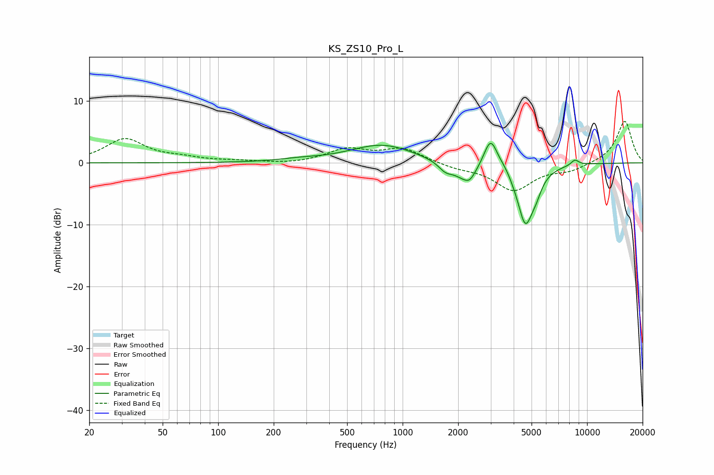

# KS_ZS10_Pro_L
See [usage instructions](https://github.com/jaakkopasanen/AutoEq#usage) for more options and info.

### Parametric EQs
Apply preamp of -3.3 dB when using parametric equalizer.

|   # | Type    |   Fc (Hz) |    Q |   Gain (dB) |
|-----|---------|-----------|------|-------------|
|   1 | Peaking |       275 | 1.27 |         0.4 |
|   2 | Peaking |       775 | 0.81 |         2.9 |
|   3 | Peaking |      1705 | 3.8  |        -1.2 |
|   4 | Peaking |      2214 | 2.07 |        -3   |
|   5 | Peaking |      2308 | 5.8  |        -0.8 |
|   6 | Peaking |      3000 | 3.68 |         5.1 |
|   7 | Peaking |      3595 | 4.53 |         0.6 |
|   8 | Peaking |      4628 | 3.06 |        -9.7 |
|   9 | Peaking |      5299 | 4.81 |        -1.6 |
|  10 | Peaking |      8593 | 5.98 |         0.9 |

### Fixed Band EQs
When using fixed band (also called graphic) equalizer, apply preamp of **-6.8 dB** (if available) and set gains manually with these parameters.

|   # | Type    |   Fc (Hz) |    Q |   Gain (dB) |
|-----|---------|-----------|------|-------------|
|   1 | Peaking |        31 | 1.41 |         3.8 |
|   2 | Peaking |        62 | 1.41 |         0.6 |
|   3 | Peaking |       125 | 1.41 |         0.2 |
|   4 | Peaking |       250 | 1.41 |        -0.2 |
|   5 | Peaking |       500 | 1.41 |         2.1 |
|   6 | Peaking |      1000 | 1.41 |         2.2 |
|   7 | Peaking |      2000 | 1.41 |        -0.7 |
|   8 | Peaking |      4000 | 1.41 |        -4.4 |
|   9 | Peaking |      8000 | 1.41 |        -1.1 |
|  10 | Peaking |     16000 | 1.41 |         6.8 |

### Graphs

