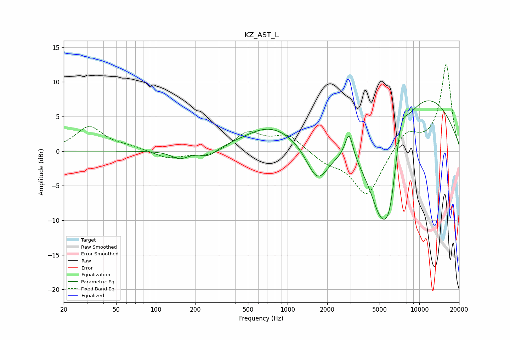

# KZ_AST_L
See [usage instructions](https://github.com/jaakkopasanen/AutoEq#usage) for more options and info.

### Parametric EQs
Apply preamp of -7.4 dB when using parametric equalizer.

|   # | Type    |   Fc (Hz) |    Q |   Gain (dB) |
|-----|---------|-----------|------|-------------|
|   1 | Peaking |       152 | 2.19 |        -1.2 |
|   2 | Peaking |       251 | 2.07 |        -1.2 |
|   3 | Peaking |       680 | 0.98 |         0.8 |
|   4 | Peaking |       837 | 0.57 |         2.9 |
|   5 | Peaking |      1686 | 1.57 |        -5.8 |
|   6 | Peaking |      2928 | 4.61 |         4   |
|   7 | Peaking |      5101 | 1.05 |       -15.2 |
|   8 | Peaking |      5967 | 2.49 |        -6.5 |
|   9 | Peaking |      7258 | 3.12 |         4.5 |
|  10 | Peaking |      8776 | 0.34 |        10.8 |

### Fixed Band EQs
When using fixed band (also called graphic) equalizer, apply preamp of **-12.6 dB** (if available) and set gains manually with these parameters.

|   # | Type    |   Fc (Hz) |    Q |   Gain (dB) |
|-----|---------|-----------|------|-------------|
|   1 | Peaking |        31 | 1.41 |         3.5 |
|   2 | Peaking |        62 | 1.41 |         0.5 |
|   3 | Peaking |       125 | 1.41 |        -1.1 |
|   4 | Peaking |       250 | 1.41 |        -0.9 |
|   5 | Peaking |       500 | 1.41 |         2.6 |
|   6 | Peaking |      1000 | 1.41 |         2.3 |
|   7 | Peaking |      2000 | 1.41 |        -1.4 |
|   8 | Peaking |      4000 | 1.41 |        -6.5 |
|   9 | Peaking |      8000 | 1.41 |         2.8 |
|  10 | Peaking |     16000 | 1.41 |        12.5 |

### Graphs

