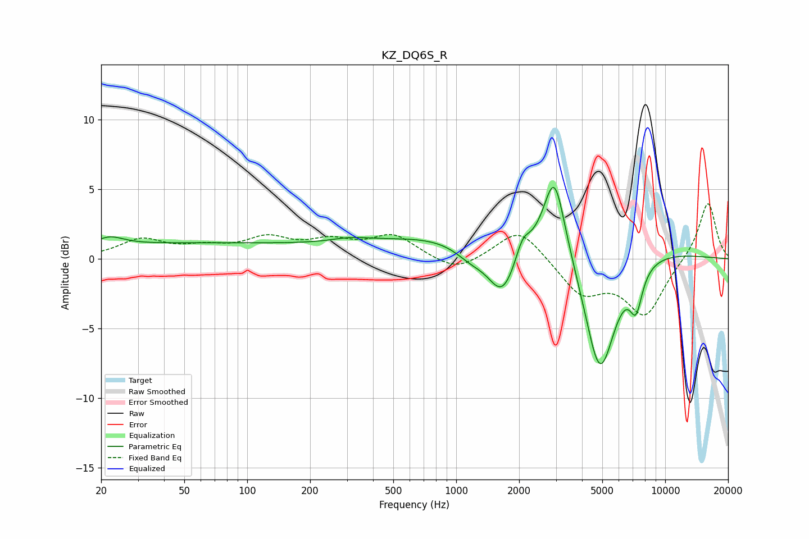

# KZ_DQ6S_R
See [usage instructions](https://github.com/jaakkopasanen/AutoEq#usage) for more options and info.

### Parametric EQs
Apply preamp of -5.2 dB when using parametric equalizer.

|   # | Type    |   Fc (Hz) |    Q |   Gain (dB) |
|-----|---------|-----------|------|-------------|
|   1 | Peaking |        22 | 2.12 |         0.7 |
|   2 | Peaking |        55 | 0.22 |         1.1 |
|   3 | Peaking |       310 | 1.59 |         0.3 |
|   4 | Peaking |      1179 | 1.74 |        -1.1 |
|   5 | Peaking |      1666 | 2.01 |        -3.8 |
|   6 | Peaking |      1987 | 0.18 |         2   |
|   7 | Peaking |      2078 | 4.4  |         1.3 |
|   8 | Peaking |      2951 | 2.76 |         5.8 |
|   9 | Peaking |      4870 | 1.78 |        -9.5 |
|  10 | Peaking |      7256 | 4.44 |        -2.8 |

### Fixed Band EQs
When using fixed band (also called graphic) equalizer, apply preamp of **-4.1 dB** (if available) and set gains manually with these parameters.

|   # | Type    |   Fc (Hz) |    Q |   Gain (dB) |
|-----|---------|-----------|------|-------------|
|   1 | Peaking |        31 | 1.41 |         1.3 |
|   2 | Peaking |        62 | 1.41 |         0.6 |
|   3 | Peaking |       125 | 1.41 |         1.3 |
|   4 | Peaking |       250 | 1.41 |         1.1 |
|   5 | Peaking |       500 | 1.41 |         1.6 |
|   6 | Peaking |      1000 | 1.41 |        -1   |
|   7 | Peaking |      2000 | 1.41 |         2.3 |
|   8 | Peaking |      4000 | 1.41 |        -2.5 |
|   9 | Peaking |      8000 | 1.41 |        -3.9 |
|  10 | Peaking |     16000 | 1.41 |         4.2 |

### Graphs

