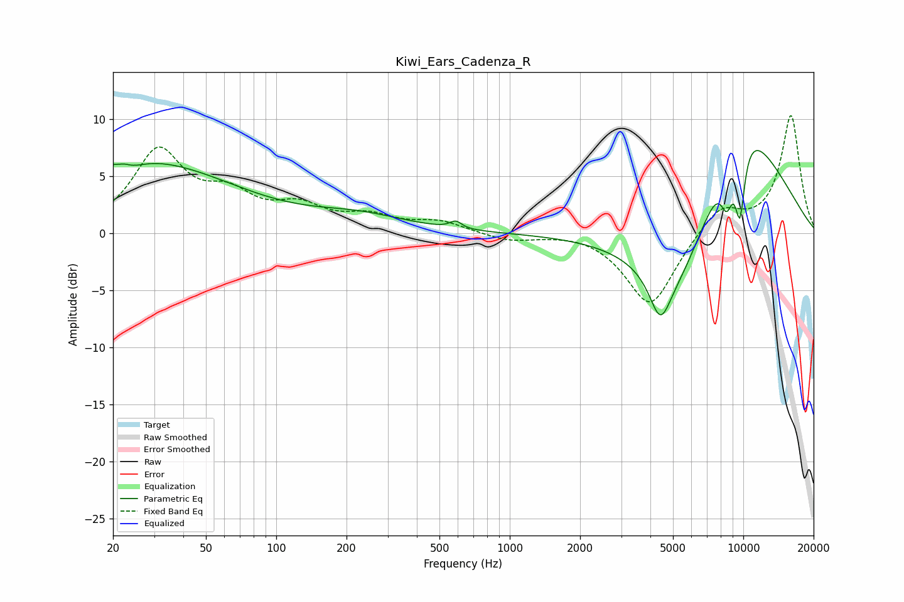

# Kiwi_Ears_Cadenza_R
See [usage instructions](https://github.com/jaakkopasanen/AutoEq#usage) for more options and info.

### Parametric EQs
Apply preamp of -7.3 dB when using parametric equalizer.

|   # | Type    |   Fc (Hz) |    Q |   Gain (dB) |
|-----|---------|-----------|------|-------------|
|   1 | Peaking |        22 | 5.03 |         0.3 |
|   2 | Peaking |        23 | 2.32 |        -0.7 |
|   3 | Peaking |        25 | 0.33 |         6.5 |
|   4 | Peaking |       226 | 0.68 |         1.3 |
|   5 | Peaking |       587 | 5.79 |         0.6 |
|   6 | Peaking |      4411 | 3.14 |        -3.9 |
|   7 | Peaking |      5306 | 0.79 |        -9.1 |
|   8 | Peaking |      8516 | 4.61 |        -3.6 |
|   9 | Peaking |      9404 | 0.61 |        12.1 |
|  10 | Peaking |      9677 | 5.75 |        -6.1 |

### Fixed Band EQs
When using fixed band (also called graphic) equalizer, apply preamp of **-10.4 dB** (if available) and set gains manually with these parameters.

|   # | Type    |   Fc (Hz) |    Q |   Gain (dB) |
|-----|---------|-----------|------|-------------|
|   1 | Peaking |        31 | 1.41 |         7   |
|   2 | Peaking |        62 | 1.41 |         2.7 |
|   3 | Peaking |       125 | 1.41 |         2   |
|   4 | Peaking |       250 | 1.41 |         1.3 |
|   5 | Peaking |       500 | 1.41 |         0.9 |
|   6 | Peaking |      1000 | 1.41 |        -0.7 |
|   7 | Peaking |      2000 | 1.41 |         0.2 |
|   8 | Peaking |      4000 | 1.41 |        -6.5 |
|   9 | Peaking |      8000 | 1.41 |         2.4 |
|  10 | Peaking |     16000 | 1.41 |        10.3 |

### Graphs

