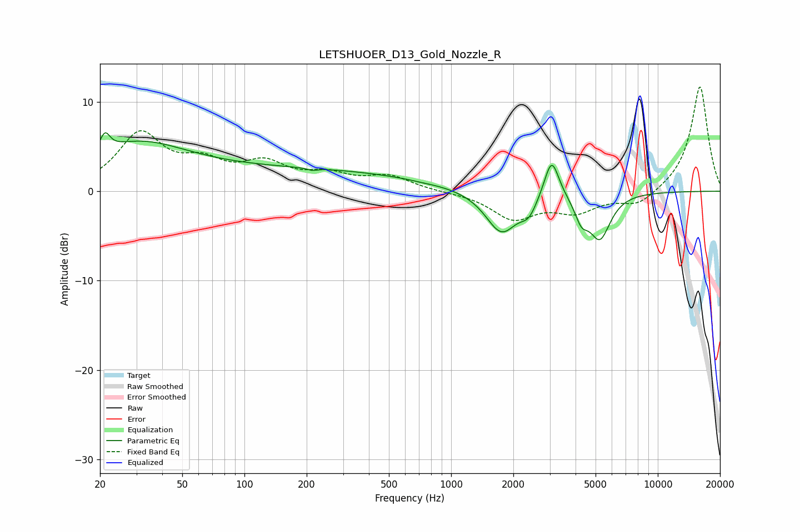

# LETSHUOER_D13_Gold_Nozzle_R
See [usage instructions](https://github.com/jaakkopasanen/AutoEq#usage) for more options and info.

### Parametric EQs
Apply preamp of -6.6 dB when using parametric equalizer.

|   # | Type    |   Fc (Hz) |    Q |   Gain (dB) |
|-----|---------|-----------|------|-------------|
|   1 | Peaking |        21 | 6    |         2   |
|   2 | Peaking |        29 | 0.58 |         4.7 |
|   3 | Peaking |       185 | 0.24 |         2.3 |
|   4 | Peaking |       213 | 6    |        -0.3 |
|   5 | Peaking |       720 | 3.58 |        -0.1 |
|   6 | Peaking |      1752 | 1.85 |        -4.7 |
|   7 | Peaking |      2376 | 3.61 |        -1.7 |
|   8 | Peaking |      3065 | 4    |         4.6 |
|   9 | Peaking |      4270 | 4.36 |        -2.2 |
|  10 | Peaking |      5244 | 2.73 |        -5   |

### Fixed Band EQs
When using fixed band (also called graphic) equalizer, apply preamp of **-11.8 dB** (if available) and set gains manually with these parameters.

|   # | Type    |   Fc (Hz) |    Q |   Gain (dB) |
|-----|---------|-----------|------|-------------|
|   1 | Peaking |        31 | 1.41 |         6.2 |
|   2 | Peaking |        62 | 1.41 |         2.6 |
|   3 | Peaking |       125 | 1.41 |         2.7 |
|   4 | Peaking |       250 | 1.41 |         1.6 |
|   5 | Peaking |       500 | 1.41 |         1.6 |
|   6 | Peaking |      1000 | 1.41 |        -0.1 |
|   7 | Peaking |      2000 | 1.41 |        -3   |
|   8 | Peaking |      4000 | 1.41 |        -2.1 |
|   9 | Peaking |      8000 | 1.41 |        -1.6 |
|  10 | Peaking |     16000 | 1.41 |        11.8 |

### Graphs

