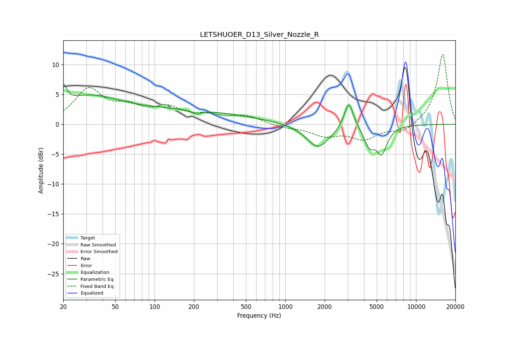

# LETSHUOER_D13_Silver_Nozzle_R
See [usage instructions](https://github.com/jaakkopasanen/AutoEq#usage) for more options and info.

### Parametric EQs
Apply preamp of -6.8 dB when using parametric equalizer.

|   # | Type    |   Fc (Hz) |    Q |   Gain (dB) |
|-----|---------|-----------|------|-------------|
|   1 | Peaking |        20 | 5.63 |         3.1 |
|   2 | Peaking |        30 | 0.65 |         3   |
|   3 | Peaking |       108 | 0.18 |         2.4 |
|   4 | Peaking |       111 | 4.95 |         0.1 |
|   5 | Peaking |       209 | 4.88 |        -0.6 |
|   6 | Peaking |      1781 | 1.58 |        -4   |
|   7 | Peaking |      3057 | 4.15 |         4.6 |
|   8 | Peaking |      4179 | 4.08 |        -1.2 |
|   9 | Peaking |      4470 | 4.67 |        -1.8 |
|  10 | Peaking |      5435 | 3.19 |        -4.6 |

### Fixed Band EQs
When using fixed band (also called graphic) equalizer, apply preamp of **-11.8 dB** (if available) and set gains manually with these parameters.

|   # | Type    |   Fc (Hz) |    Q |   Gain (dB) |
|-----|---------|-----------|------|-------------|
|   1 | Peaking |        31 | 1.41 |         5.6 |
|   2 | Peaking |        62 | 1.41 |         2.3 |
|   3 | Peaking |       125 | 1.41 |         2.4 |
|   4 | Peaking |       250 | 1.41 |         1.2 |
|   5 | Peaking |       500 | 1.41 |         1.3 |
|   6 | Peaking |      1000 | 1.41 |        -0.5 |
|   7 | Peaking |      2000 | 1.41 |        -1.7 |
|   8 | Peaking |      4000 | 1.41 |        -2.3 |
|   9 | Peaking |      8000 | 1.41 |        -1.3 |
|  10 | Peaking |     16000 | 1.41 |        11.9 |

### Graphs

