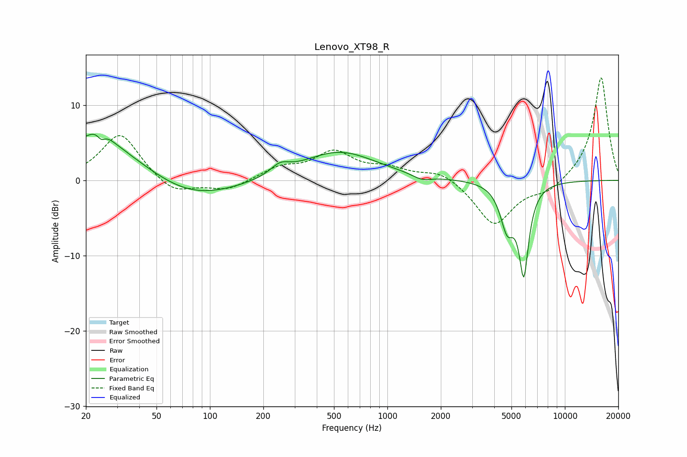

# Lenovo_XT98_R
See [usage instructions](https://github.com/jaakkopasanen/AutoEq#usage) for more options and info.

### Parametric EQs
Apply preamp of -6.2 dB when using parametric equalizer.

|   # | Type    |   Fc (Hz) |    Q |   Gain (dB) |
|-----|---------|-----------|------|-------------|
|   1 | Peaking |        23 | 0.49 |         5.7 |
|   2 | Peaking |        24 | 2.41 |         1.9 |
|   3 | Peaking |        24 | 5.86 |         1.1 |
|   4 | Peaking |        24 | 5.98 |        -2.3 |
|   5 | Peaking |        75 | 0.55 |        -3.2 |
|   6 | Peaking |       248 | 2.7  |         1.3 |
|   7 | Peaking |       532 | 0.67 |         3.8 |
|   8 | Peaking |      1566 | 2.67 |        -0.7 |
|   9 | Peaking |      4731 | 3.57 |        -5.5 |
|  10 | Peaking |      5869 | 4.93 |       -11.5 |

### Fixed Band EQs
When using fixed band (also called graphic) equalizer, apply preamp of **-13.7 dB** (if available) and set gains manually with these parameters.

|   # | Type    |   Fc (Hz) |    Q |   Gain (dB) |
|-----|---------|-----------|------|-------------|
|   1 | Peaking |        31 | 1.41 |         6.3 |
|   2 | Peaking |        62 | 1.41 |        -2   |
|   3 | Peaking |       125 | 1.41 |        -1.3 |
|   4 | Peaking |       250 | 1.41 |         1.6 |
|   5 | Peaking |       500 | 1.41 |         3.5 |
|   6 | Peaking |      1000 | 1.41 |         1.4 |
|   7 | Peaking |      2000 | 1.41 |         1.4 |
|   8 | Peaking |      4000 | 1.41 |        -6   |
|   9 | Peaking |      8000 | 1.41 |        -1.5 |
|  10 | Peaking |     16000 | 1.41 |        13.9 |

### Graphs

