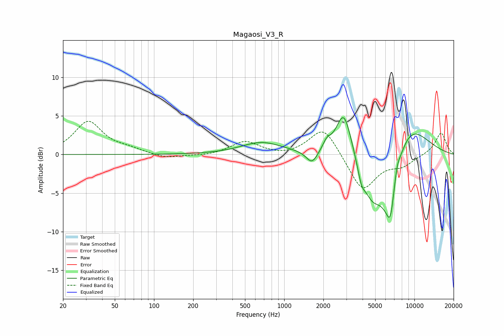

# Magaosi_V3_R
See [usage instructions](https://github.com/jaakkopasanen/AutoEq#usage) for more options and info.

### Parametric EQs
Apply preamp of -4.9 dB when using parametric equalizer.

|   # | Type    |   Fc (Hz) |    Q |   Gain (dB) |
|-----|---------|-----------|------|-------------|
|   1 | Peaking |       670 | 0.91 |         1.6 |
|   2 | Peaking |      1634 | 3.23 |        -1.8 |
|   3 | Peaking |      2126 | 4.63 |         1   |
|   4 | Peaking |      2872 | 2.4  |         5.9 |
|   5 | Peaking |      3914 | 4.93 |        -1.9 |
|   6 | Peaking |      4714 | 1.75 |        -5.2 |
|   7 | Peaking |      6433 | 1.77 |        -8.5 |
|   8 | Peaking |      6540 | 6    |        -2.1 |
|   9 | Peaking |      7368 | 5.99 |         1.5 |
|  10 | Peaking |      8544 | 0.81 |         5.3 |

### Fixed Band EQs
When using fixed band (also called graphic) equalizer, apply preamp of **-4.4 dB** (if available) and set gains manually with these parameters.

|   # | Type    |   Fc (Hz) |    Q |   Gain (dB) |
|-----|---------|-----------|------|-------------|
|   1 | Peaking |        31 | 1.41 |         4.2 |
|   2 | Peaking |        62 | 1.41 |         0.6 |
|   3 | Peaking |       125 | 1.41 |        -0.5 |
|   4 | Peaking |       250 | 1.41 |        -0.2 |
|   5 | Peaking |       500 | 1.41 |         1.7 |
|   6 | Peaking |      1000 | 1.41 |        -0.3 |
|   7 | Peaking |      2000 | 1.41 |         3.7 |
|   8 | Peaking |      4000 | 1.41 |        -4.8 |
|   9 | Peaking |      8000 | 1.41 |        -1.3 |
|  10 | Peaking |     16000 | 1.41 |         2.9 |

### Graphs

