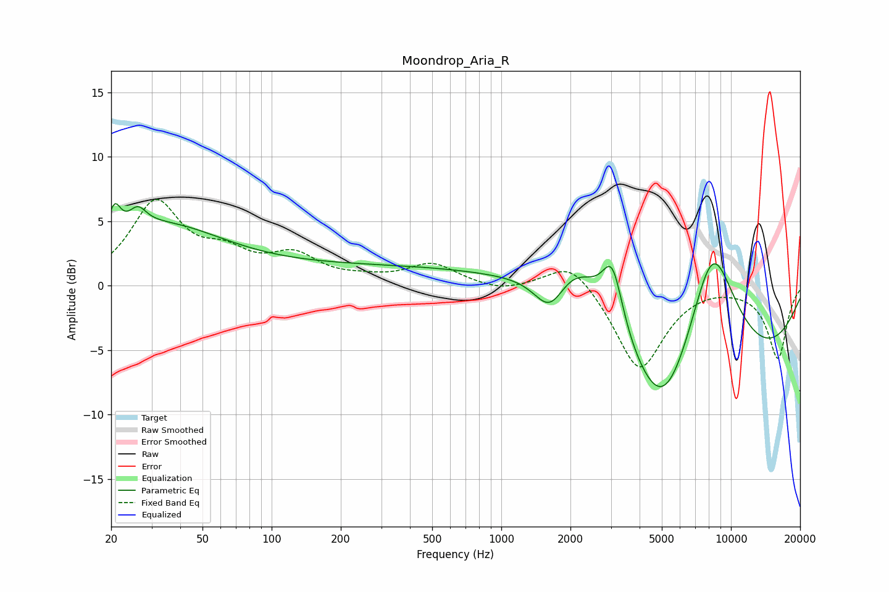

# Moondrop_Aria_R
See [usage instructions](https://github.com/jaakkopasanen/AutoEq#usage) for more options and info.

### Parametric EQs
Apply preamp of -6.5 dB when using parametric equalizer.

|   # | Type    |   Fc (Hz) |    Q |   Gain (dB) |
|-----|---------|-----------|------|-------------|
|   1 | Peaking |        21 | 5.43 |         2.3 |
|   2 | Peaking |        26 | 3.79 |         1.4 |
|   3 | Peaking |        32 | 0.5  |         4.4 |
|   4 | Peaking |       423 | 0.18 |         1.5 |
|   5 | Peaking |      1632 | 1.99 |        -3.4 |
|   6 | Peaking |      2082 | 0.97 |         5.2 |
|   7 | Peaking |      3047 | 3.09 |         4.8 |
|   8 | Peaking |      5094 | 1.11 |        -6.1 |
|   9 | Peaking |      7798 | 0.28 |       -10.3 |
|  10 | Peaking |      8264 | 0.95 |        13.7 |

### Fixed Band EQs
When using fixed band (also called graphic) equalizer, apply preamp of **-6.8 dB** (if available) and set gains manually with these parameters.

|   # | Type    |   Fc (Hz) |    Q |   Gain (dB) |
|-----|---------|-----------|------|-------------|
|   1 | Peaking |        31 | 1.41 |         6.3 |
|   2 | Peaking |        62 | 1.41 |         1.9 |
|   3 | Peaking |       125 | 1.41 |         2.1 |
|   4 | Peaking |       250 | 1.41 |         0.3 |
|   5 | Peaking |       500 | 1.41 |         1.6 |
|   6 | Peaking |      1000 | 1.41 |        -0.5 |
|   7 | Peaking |      2000 | 1.41 |         2.2 |
|   8 | Peaking |      4000 | 1.41 |        -6.6 |
|   9 | Peaking |      8000 | 1.41 |         0.2 |
|  10 | Peaking |     16000 | 1.41 |        -5.6 |

### Graphs

