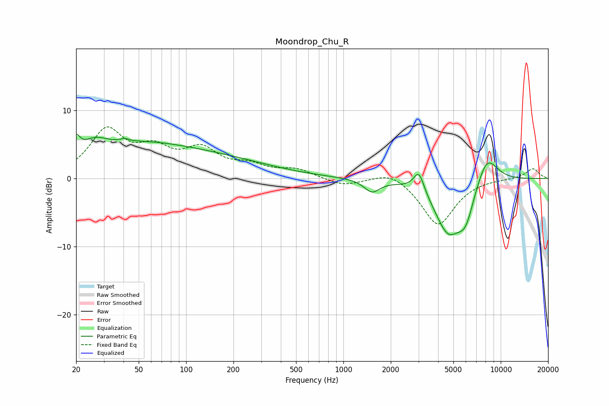

# Moondrop_Chu_R
See [usage instructions](https://github.com/jaakkopasanen/AutoEq#usage) for more options and info.

### Parametric EQs
Apply preamp of -6.6 dB when using parametric equalizer.

|   # | Type    |   Fc (Hz) |    Q |   Gain (dB) |
|-----|---------|-----------|------|-------------|
|   1 | Peaking |        20 | 5.76 |         2.4 |
|   2 | Peaking |        26 | 1.73 |         2   |
|   3 | Peaking |        41 | 5.73 |         0.4 |
|   4 | Peaking |        48 | 0.4  |         4.6 |
|   5 | Peaking |       185 | 0.44 |         2   |
|   6 | Peaking |      1519 | 2.87 |        -1.8 |
|   7 | Peaking |      3019 | 4.18 |         3.1 |
|   8 | Peaking |      4623 | 1.58 |        -7.4 |
|   9 | Peaking |      5984 | 2.57 |        -4.4 |
|  10 | Peaking |      8161 | 1.9  |         4.4 |

### Fixed Band EQs
When using fixed band (also called graphic) equalizer, apply preamp of **-7.7 dB** (if available) and set gains manually with these parameters.

|   # | Type    |   Fc (Hz) |    Q |   Gain (dB) |
|-----|---------|-----------|------|-------------|
|   1 | Peaking |        31 | 1.41 |         6.8 |
|   2 | Peaking |        62 | 1.41 |         3.5 |
|   3 | Peaking |       125 | 1.41 |         3.8 |
|   4 | Peaking |       250 | 1.41 |         1.6 |
|   5 | Peaking |       500 | 1.41 |         1.2 |
|   6 | Peaking |      1000 | 1.41 |        -1.1 |
|   7 | Peaking |      2000 | 1.41 |         1.4 |
|   8 | Peaking |      4000 | 1.41 |        -6.9 |
|   9 | Peaking |      8000 | 1.41 |         0   |
|  10 | Peaking |     16000 | 1.41 |         1.5 |

### Graphs

