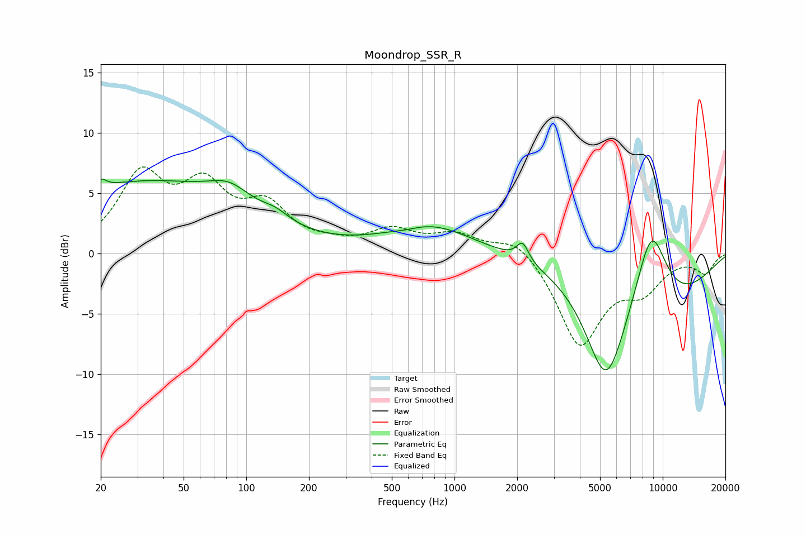

# Moondrop_SSR_R
See [usage instructions](https://github.com/jaakkopasanen/AutoEq#usage) for more options and info.

### Parametric EQs
Apply preamp of -6.3 dB when using parametric equalizer.

|   # | Type    |   Fc (Hz) |    Q |   Gain (dB) |
|-----|---------|-----------|------|-------------|
|   1 | Peaking |        20 | 5.64 |         0.7 |
|   2 | Peaking |        32 | 0.29 |         5.8 |
|   3 | Peaking |        83 | 1.4  |         1.6 |
|   4 | Peaking |       138 | 2.15 |         0.7 |
|   5 | Peaking |       589 | 1.94 |        -0.3 |
|   6 | Peaking |       755 | 0.71 |         2.3 |
|   7 | Peaking |      2124 | 4.97 |         1.5 |
|   8 | Peaking |      5338 | 1.41 |        -8.7 |
|   9 | Peaking |      8800 | 1.65 |         7   |
|  10 | Peaking |      9902 | 0.47 |        -4   |

### Fixed Band EQs
When using fixed band (also called graphic) equalizer, apply preamp of **-7.3 dB** (if available) and set gains manually with these parameters.

|   # | Type    |   Fc (Hz) |    Q |   Gain (dB) |
|-----|---------|-----------|------|-------------|
|   1 | Peaking |        31 | 1.41 |         6.1 |
|   2 | Peaking |        62 | 1.41 |         4.8 |
|   3 | Peaking |       125 | 1.41 |         3.4 |
|   4 | Peaking |       250 | 1.41 |         0.5 |
|   5 | Peaking |       500 | 1.41 |         1.7 |
|   6 | Peaking |      1000 | 1.41 |         1.4 |
|   7 | Peaking |      2000 | 1.41 |         1.6 |
|   8 | Peaking |      4000 | 1.41 |        -7.5 |
|   9 | Peaking |      8000 | 1.41 |        -2.6 |
|  10 | Peaking |     16000 | 1.41 |        -1.5 |

### Graphs

