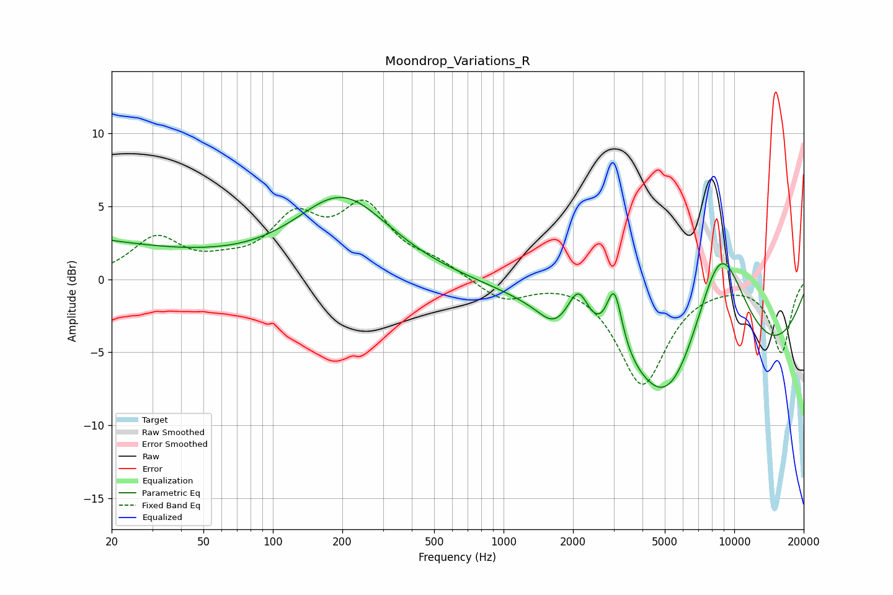

# Moondrop_Variations_R
See [usage instructions](https://github.com/jaakkopasanen/AutoEq#usage) for more options and info.

### Parametric EQs
Apply preamp of -5.7 dB when using parametric equalizer.

|   # | Type    |   Fc (Hz) |    Q |   Gain (dB) |
|-----|---------|-----------|------|-------------|
|   1 | Peaking |        20 | 0.18 |         4   |
|   2 | Peaking |        51 | 0.3  |        -2   |
|   3 | Peaking |       200 | 0.69 |         5.6 |
|   4 | Peaking |      1627 | 2.45 |        -0.8 |
|   5 | Peaking |      1719 | 1.84 |        -0.2 |
|   6 | Peaking |      2110 | 3.13 |         2.8 |
|   7 | Peaking |      3021 | 4.17 |         4.2 |
|   8 | Peaking |      5197 | 1.07 |        -4.3 |
|   9 | Peaking |      8309 | 0.27 |        -8.7 |
|  10 | Peaking |      8675 | 0.92 |        11.2 |

### Fixed Band EQs
When using fixed band (also called graphic) equalizer, apply preamp of **-5.5 dB** (if available) and set gains manually with these parameters.

|   # | Type    |   Fc (Hz) |    Q |   Gain (dB) |
|-----|---------|-----------|------|-------------|
|   1 | Peaking |        31 | 1.41 |         2.7 |
|   2 | Peaking |        62 | 1.41 |         0.7 |
|   3 | Peaking |       125 | 1.41 |         3.7 |
|   4 | Peaking |       250 | 1.41 |         4.6 |
|   5 | Peaking |       500 | 1.41 |         0.9 |
|   6 | Peaking |      1000 | 1.41 |        -1.5 |
|   7 | Peaking |      2000 | 1.41 |         0.2 |
|   8 | Peaking |      4000 | 1.41 |        -7.1 |
|   9 | Peaking |      8000 | 1.41 |        -0.1 |
|  10 | Peaking |     16000 | 1.41 |        -5   |

### Graphs

