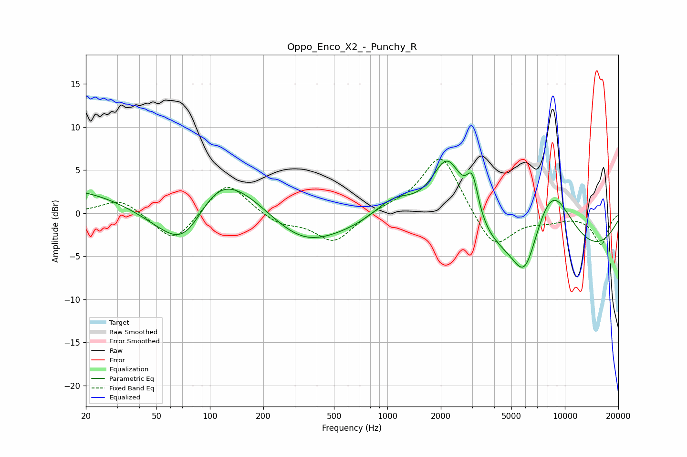

# Oppo_Enco_X2_-_Punchy_R
See [usage instructions](https://github.com/jaakkopasanen/AutoEq#usage) for more options and info.

### Parametric EQs
Apply preamp of -6.1 dB when using parametric equalizer.

|   # | Type    |   Fc (Hz) |    Q |   Gain (dB) |
|-----|---------|-----------|------|-------------|
|   1 | Peaking |        52 | 0.18 |         6.2 |
|   2 | Peaking |        73 | 0.57 |       -15.7 |
|   3 | Peaking |       105 | 0.63 |        10.1 |
|   4 | Peaking |       324 | 0.65 |        -4.9 |
|   5 | Peaking |      1093 | 1.13 |         3.6 |
|   6 | Peaking |      2184 | 1.24 |        11.3 |
|   7 | Peaking |      3013 | 4.24 |         4.5 |
|   8 | Peaking |      5909 | 0.2  |        -9.4 |
|   9 | Peaking |      5957 | 2.03 |        -5.3 |
|  10 | Peaking |      8388 | 0.86 |        11.2 |

### Fixed Band EQs
When using fixed band (also called graphic) equalizer, apply preamp of **-6.4 dB** (if available) and set gains manually with these parameters.

|   # | Type    |   Fc (Hz) |    Q |   Gain (dB) |
|-----|---------|-----------|------|-------------|
|   1 | Peaking |        31 | 1.41 |         1.8 |
|   2 | Peaking |        62 | 1.41 |        -3.6 |
|   3 | Peaking |       125 | 1.41 |         3.9 |
|   4 | Peaking |       250 | 1.41 |        -1.2 |
|   5 | Peaking |       500 | 1.41 |        -3.4 |
|   6 | Peaking |      1000 | 1.41 |         0.5 |
|   7 | Peaking |      2000 | 1.41 |         7.1 |
|   8 | Peaking |      4000 | 1.41 |        -4.4 |
|   9 | Peaking |      8000 | 1.41 |        -0.7 |
|  10 | Peaking |     16000 | 1.41 |        -3.6 |

### Graphs

