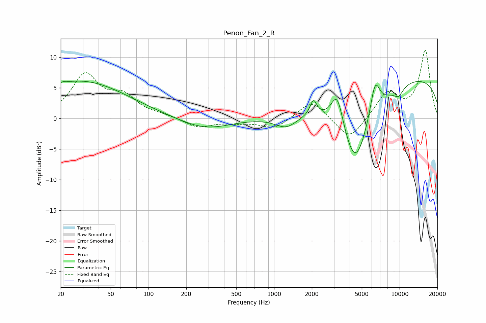

# Penon_Fan_2_R
See [usage instructions](https://github.com/jaakkopasanen/AutoEq#usage) for more options and info.

### Parametric EQs
Apply preamp of -6.2 dB when using parametric equalizer.

|   # | Type    |   Fc (Hz) |    Q |   Gain (dB) |
|-----|---------|-----------|------|-------------|
|   1 | Peaking |        21 | 5.35 |         0.3 |
|   2 | Peaking |        29 | 0.38 |         6.1 |
|   3 | Peaking |       281 | 0.72 |        -1.8 |
|   4 | Peaking |      1250 | 1.57 |        -2.1 |
|   5 | Peaking |      2059 | 5.33 |         2.5 |
|   6 | Peaking |      3188 | 2.82 |         6   |
|   7 | Peaking |      4431 | 1.09 |       -13.5 |
|   8 | Peaking |      6374 | 3.43 |         5.6 |
|   9 | Peaking |      9795 | 3.1  |        -1.5 |
|  10 | Peaking |      9974 | 0.18 |         7.2 |

### Fixed Band EQs
When using fixed band (also called graphic) equalizer, apply preamp of **-11.3 dB** (if available) and set gains manually with these parameters.

|   # | Type    |   Fc (Hz) |    Q |   Gain (dB) |
|-----|---------|-----------|------|-------------|
|   1 | Peaking |        31 | 1.41 |         6.9 |
|   2 | Peaking |        62 | 1.41 |         3.1 |
|   3 | Peaking |       125 | 1.41 |         0.4 |
|   4 | Peaking |       250 | 1.41 |        -1.5 |
|   5 | Peaking |       500 | 1.41 |        -0.5 |
|   6 | Peaking |      1000 | 1.41 |        -1.7 |
|   7 | Peaking |      2000 | 1.41 |         3.1 |
|   8 | Peaking |      4000 | 1.41 |        -3.8 |
|   9 | Peaking |      8000 | 1.41 |         4.2 |
|  10 | Peaking |     16000 | 1.41 |        11.1 |

### Graphs

