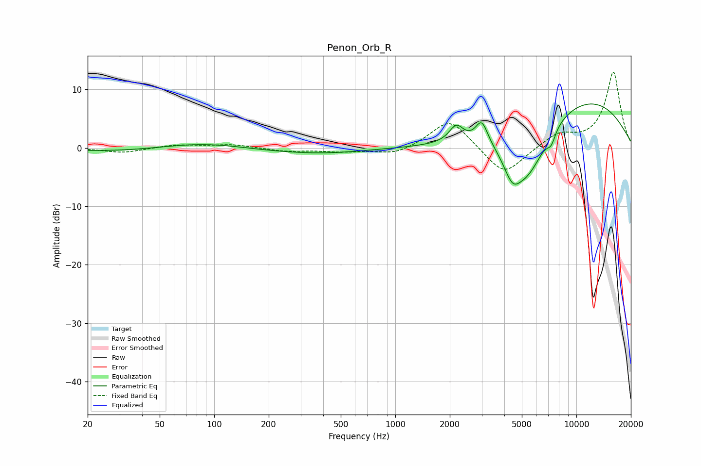

# Penon_Orb_R
See [usage instructions](https://github.com/jaakkopasanen/AutoEq#usage) for more options and info.

### Parametric EQs
Apply preamp of -7.6 dB when using parametric equalizer.

|   # | Type    |   Fc (Hz) |    Q |   Gain (dB) |
|-----|---------|-----------|------|-------------|
|   1 | Peaking |        87 | 0.53 |         2   |
|   2 | Peaking |       100 | 0.19 |        -1.4 |
|   3 | Peaking |       430 | 0.8  |        -0.3 |
|   4 | Peaking |      2171 | 3.64 |         2.9 |
|   5 | Peaking |      3001 | 4.18 |         3.9 |
|   6 | Peaking |      4433 | 2.8  |        -4.7 |
|   7 | Peaking |      5415 | 1.24 |        -9.6 |
|   8 | Peaking |      7266 | 5.72 |        -2   |
|   9 | Peaking |     10000 | 0.32 |         4.8 |
|  10 | Peaking |     10000 | 0.36 |         4.2 |

### Fixed Band EQs
When using fixed band (also called graphic) equalizer, apply preamp of **-13.1 dB** (if available) and set gains manually with these parameters.

|   # | Type    |   Fc (Hz) |    Q |   Gain (dB) |
|-----|---------|-----------|------|-------------|
|   1 | Peaking |        31 | 1.41 |        -0.8 |
|   2 | Peaking |        62 | 1.41 |         0.6 |
|   3 | Peaking |       125 | 1.41 |         0.6 |
|   4 | Peaking |       250 | 1.41 |        -0.6 |
|   5 | Peaking |       500 | 1.41 |        -0.6 |
|   6 | Peaking |      1000 | 1.41 |        -1.3 |
|   7 | Peaking |      2000 | 1.41 |         5.2 |
|   8 | Peaking |      4000 | 1.41 |        -5   |
|   9 | Peaking |      8000 | 1.41 |         2.3 |
|  10 | Peaking |     16000 | 1.41 |        13   |

### Graphs

