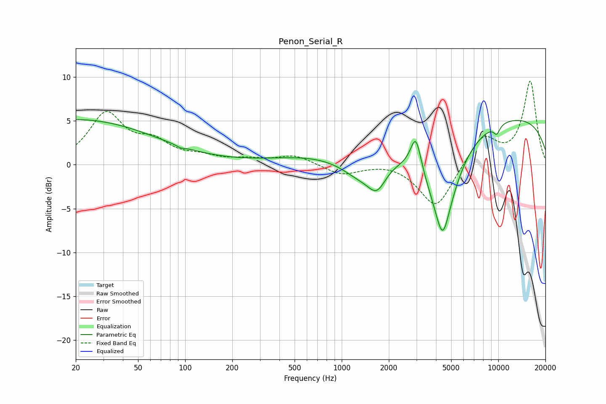

# Penon_Serial_R
See [usage instructions](https://github.com/jaakkopasanen/AutoEq#usage) for more options and info.

### Parametric EQs
Apply preamp of -5.2 dB when using parametric equalizer.

|   # | Type    |   Fc (Hz) |    Q |   Gain (dB) |
|-----|---------|-----------|------|-------------|
|   1 | Peaking |        20 | 0.27 |         5.1 |
|   2 | Peaking |        94 | 5.7  |        -0.2 |
|   3 | Peaking |       664 | 0.52 |         0.9 |
|   4 | Peaking |      1325 | 1.15 |        -2.2 |
|   5 | Peaking |      1680 | 2.46 |        -2.6 |
|   6 | Peaking |      2976 | 4.18 |         4   |
|   7 | Peaking |      4412 | 4.07 |        -2.8 |
|   8 | Peaking |      4413 | 1.31 |        -9.5 |
|   9 | Peaking |      9779 | 6    |        -1   |
|  10 | Peaking |     10000 | 0.2  |         5.7 |

### Fixed Band EQs
When using fixed band (also called graphic) equalizer, apply preamp of **-9.6 dB** (if available) and set gains manually with these parameters.

|   # | Type    |   Fc (Hz) |    Q |   Gain (dB) |
|-----|---------|-----------|------|-------------|
|   1 | Peaking |        31 | 1.41 |         5.6 |
|   2 | Peaking |        62 | 1.41 |         2.2 |
|   3 | Peaking |       125 | 1.41 |         0.7 |
|   4 | Peaking |       250 | 1.41 |         0.5 |
|   5 | Peaking |       500 | 1.41 |         1.1 |
|   6 | Peaking |      1000 | 1.41 |        -1.2 |
|   7 | Peaking |      2000 | 1.41 |         0.3 |
|   8 | Peaking |      4000 | 1.41 |        -5   |
|   9 | Peaking |      8000 | 1.41 |         3.3 |
|  10 | Peaking |     16000 | 1.41 |         9.5 |

### Graphs

