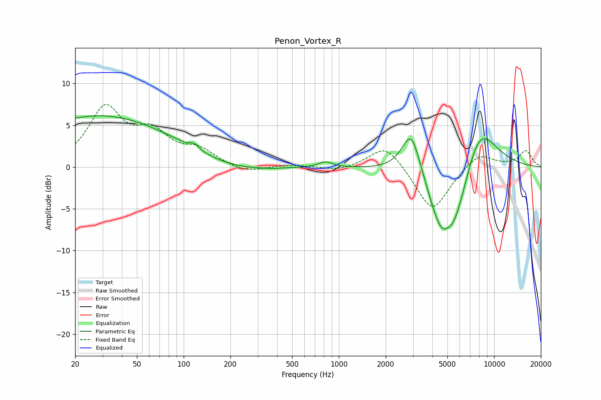

# Penon_Vortex_R
See [usage instructions](https://github.com/jaakkopasanen/AutoEq#usage) for more options and info.

### Parametric EQs
Apply preamp of -6.2 dB when using parametric equalizer.

|   # | Type    |   Fc (Hz) |    Q |   Gain (dB) |
|-----|---------|-----------|------|-------------|
|   1 | Peaking |        29 | 0.29 |         6.2 |
|   2 | Peaking |       117 | 4.9  |         0.6 |
|   3 | Peaking |       208 | 0.61 |        -0.9 |
|   4 | Peaking |       373 | 3.53 |        -0.1 |
|   5 | Peaking |       818 | 3.07 |         0.7 |
|   6 | Peaking |      2929 | 2.27 |         5.7 |
|   7 | Peaking |      4533 | 1.91 |        -3.7 |
|   8 | Peaking |      5026 | 5.13 |         0.4 |
|   9 | Peaking |      5437 | 1.19 |        -8.7 |
|  10 | Peaking |      7889 | 1.11 |         7.2 |

### Fixed Band EQs
When using fixed band (also called graphic) equalizer, apply preamp of **-7.6 dB** (if available) and set gains manually with these parameters.

|   # | Type    |   Fc (Hz) |    Q |   Gain (dB) |
|-----|---------|-----------|------|-------------|
|   1 | Peaking |        31 | 1.41 |         6.8 |
|   2 | Peaking |        62 | 1.41 |         3.5 |
|   3 | Peaking |       125 | 1.41 |         1.8 |
|   4 | Peaking |       250 | 1.41 |        -0.8 |
|   5 | Peaking |       500 | 1.41 |         0.3 |
|   6 | Peaking |      1000 | 1.41 |        -0.5 |
|   7 | Peaking |      2000 | 1.41 |         2.9 |
|   8 | Peaking |      4000 | 1.41 |        -5.5 |
|   9 | Peaking |      8000 | 1.41 |         1.8 |
|  10 | Peaking |     16000 | 1.41 |         1.9 |

### Graphs

