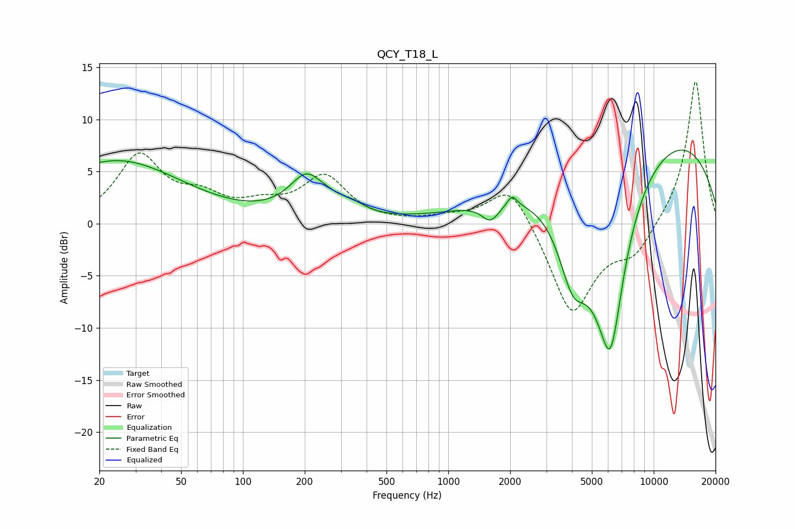

# QCY_T18_L
See [usage instructions](https://github.com/jaakkopasanen/AutoEq#usage) for more options and info.

### Parametric EQs
Apply preamp of -7.2 dB when using parametric equalizer.

|   # | Type    |   Fc (Hz) |    Q |   Gain (dB) |
|-----|---------|-----------|------|-------------|
|   1 | Peaking |        24 | 0.44 |         6   |
|   2 | Peaking |       212 | 1.6  |         4.9 |
|   3 | Peaking |       225 | 2.76 |        -0.9 |
|   4 | Peaking |       341 | 2.32 |         0.7 |
|   5 | Peaking |      1605 | 3.37 |        -1.7 |
|   6 | Peaking |      2047 | 5.94 |         1.1 |
|   7 | Peaking |      4028 | 2.07 |        -5.8 |
|   8 | Peaking |      5490 | 0.83 |        -8.7 |
|   9 | Peaking |      6169 | 2.17 |       -11.8 |
|  10 | Peaking |      8819 | 0.22 |         9.9 |

### Fixed Band EQs
When using fixed band (also called graphic) equalizer, apply preamp of **-13.7 dB** (if available) and set gains manually with these parameters.

|   # | Type    |   Fc (Hz) |    Q |   Gain (dB) |
|-----|---------|-----------|------|-------------|
|   1 | Peaking |        31 | 1.41 |         6.3 |
|   2 | Peaking |        62 | 1.41 |         2   |
|   3 | Peaking |       125 | 1.41 |         1.4 |
|   4 | Peaking |       250 | 1.41 |         4.3 |
|   5 | Peaking |       500 | 1.41 |        -0   |
|   6 | Peaking |      1000 | 1.41 |         0.5 |
|   7 | Peaking |      2000 | 1.41 |         4.2 |
|   8 | Peaking |      4000 | 1.41 |        -8.8 |
|   9 | Peaking |      8000 | 1.41 |        -2.7 |
|  10 | Peaking |     16000 | 1.41 |        14   |

### Graphs

