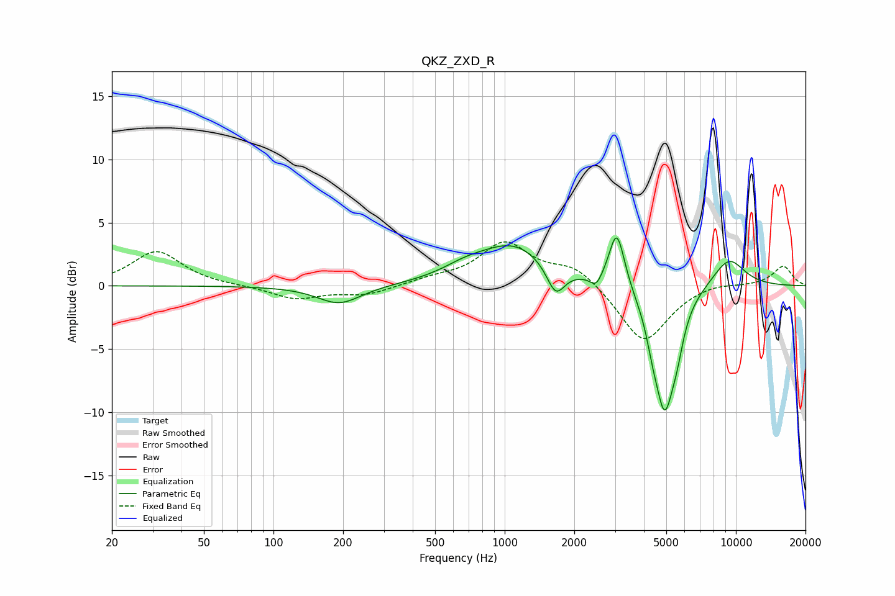

# QKZ_ZXD_R
See [usage instructions](https://github.com/jaakkopasanen/AutoEq#usage) for more options and info.

### Parametric EQs
Apply preamp of -3.9 dB when using parametric equalizer.

|   # | Type    |   Fc (Hz) |    Q |   Gain (dB) |
|-----|---------|-----------|------|-------------|
|   1 | Peaking |       193 | 1.48 |        -1.5 |
|   2 | Peaking |       673 | 1.4  |         0.8 |
|   3 | Peaking |      1098 | 0.93 |         3.1 |
|   4 | Peaking |      1662 | 3.63 |        -2.3 |
|   5 | Peaking |      2490 | 5.52 |        -1   |
|   6 | Peaking |      3055 | 4.19 |         4.6 |
|   7 | Peaking |      4342 | 6    |        -1.1 |
|   8 | Peaking |      4912 | 2.98 |        -9.6 |
|   9 | Peaking |      5569 | 5.01 |        -1.6 |
|  10 | Peaking |      9311 | 1.76 |         2.3 |

### Fixed Band EQs
When using fixed band (also called graphic) equalizer, apply preamp of **-3.6 dB** (if available) and set gains manually with these parameters.

|   # | Type    |   Fc (Hz) |    Q |   Gain (dB) |
|-----|---------|-----------|------|-------------|
|   1 | Peaking |        31 | 1.41 |         2.7 |
|   2 | Peaking |        62 | 1.41 |        -0   |
|   3 | Peaking |       125 | 1.41 |        -1   |
|   4 | Peaking |       250 | 1.41 |        -0.7 |
|   5 | Peaking |       500 | 1.41 |         0.5 |
|   6 | Peaking |      1000 | 1.41 |         3.3 |
|   7 | Peaking |      2000 | 1.41 |         1.5 |
|   8 | Peaking |      4000 | 1.41 |        -4.6 |
|   9 | Peaking |      8000 | 1.41 |         0.3 |
|  10 | Peaking |     16000 | 1.41 |         1.6 |

### Graphs

